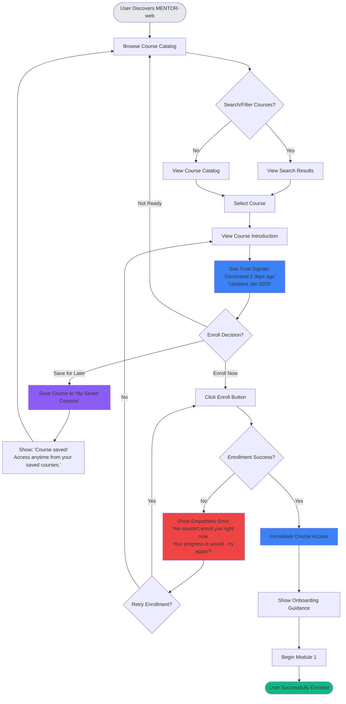
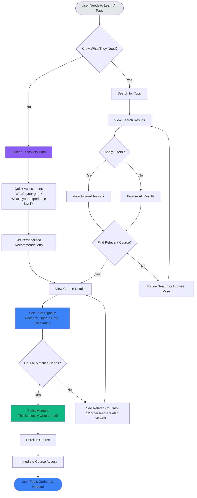

# UX Design Specification agent-teacher

**Author:** Casey
**Date:** 2026-01-07T14:30:00.000Z

---

<!-- UX design content will be appended sequentially through collaborative workflow steps -->

## Executive Summary

### Project Vision

MENTOR-web is an autonomous learning platform that generates AI education content 10x faster than human teams, while continuously improving itself through feedback loops and agent coordination. The platform delivers high-quality educational content that keeps pace with rapidly evolving AI technologies, enabling professionals to learn cutting-edge AI topics immediately rather than waiting months for traditional course creation.

### Target Users

**Primary User Profile:**
- **Demographics:** Professionals (marketing managers, developers, business professionals) aged 25-45
- **Tech-Savviness:** Moderate to high (comfortable with web applications, may not be AI experts)
- **Motivation:** Career advancement, practical AI implementation, staying current with rapidly evolving AI landscape
- **Pain Points:** Frustrated with outdated traditional courses, slow content creation cycles, generic courses that don't match their specific needs
- **Success Goal:** Users can implement AI in both professional and personal settings, in any use case that interests them

**User Journey Example (Alex Chen):**
- **Starting State:** Frustrated marketing manager struggling to learn AI from outdated courses
- **Discovery:** Finds MENTOR-web through search for "learn AI fast"
- **Engagement:** Discovers course on exact topic needed (AI-Powered Marketing Automation) with recent techniques
- **Learning:** Interactive tutor adapts to marketing background, provides real-time help
- **Outcome:** Successfully builds AI chatbot, automates workflows, becomes agency AI expert
- **Emotional Arc:** Frustration → Hope → Confidence → Pride

**Device Usage:**
- **Primary:** Desktop/laptop for deep learning sessions
- **Secondary:** Mobile for quick reference and on-the-go help
- **Context:** Work hours, evenings for learning, mobile for quick assistance

### Key Design Challenges

1. **Trust & Transparency:** Building user trust in AI-generated education while being transparent about autonomous generation without overwhelming users with technical details. Users may perceive "too fast to be good" - need to demonstrate quality parity with traditional platforms.

2. **Course Generation Wait Time:** Managing user expectations during 30-minute course generation with clear progress communication, engagement strategies, and productive use of wait time (turn waiting into learning opportunity).

3. **Real-Time Tutoring Interface:** Creating a responsive, context-aware WebSocket chat interface that feels like a real tutor (not a chatbot), providing helpful assistance without overwhelming the learning experience. Must handle reconnection gracefully and maintain conversation history.

4. **Self-Improvement Visibility:** Making the platform's autonomous improvement tangible and valuable to users without technical complexity. Users need to see and trust that the platform is getting better over time.

5. **Onboarding Skeptical Users:** Quickly demonstrating value to users frustrated with traditional platforms and addressing "too fast to be good" perceptions. Need immediate proof of quality and trust-building elements.

6. **Complex System Simplicity:** Presenting a simple, intuitive UX while the multi-agent orchestration system operates behind the scenes. Hide complexity while maintaining transparency where it builds trust.

7. **Premium Course Pages:** Creating SEO-optimized course pages that feel high-quality and professional, avoiding generic AI-generated appearance. Must build trust through professional presentation while maintaining discoverability.

### Design Opportunities

1. **Real-Time Generation Progress:** Show course generation progress in real-time with transparent stages ("Researching latest AI techniques..." → "Designing curriculum structure..." → "Generating content modules..." → "Quality assurance review...") to build trust and manage expectations effectively.

2. **Visible Self-Improvement Metrics:** Display quality improvements, speed improvements, and capability enhancements (e.g., "This course was generated 30% faster than last month", "Our content quality score improved 15% this quarter") to make platform evolution tangible and valuable. Consider a "Platform Evolution" or "Platform Insights" section.

3. **Adaptive Tutoring Interface:** Context-aware chat that provides personalized explanations and alternative approaches when users get stuck, adapting to user background (e.g., marketing examples for marketing professionals). Should feel like a real tutor, not a chatbot.

4. **Clear Progress Visualization:** Multi-course progress tracking that motivates continued learning and shows skill development across multiple AI topic areas. Clear indicators like "You're 60% through this module" with logical navigation.

5. **Smart Empty States:** Effective guidance for new users, especially for first-time course generation, with different states for new vs. returning learners. Guide users through what's happening, why it takes 30 minutes, and what they can expect.

6. **Premium Course Pages:** SEO-optimized course pages that feel high-quality and professional with hero sections, clear value propositions, learning outcomes, estimated time, and all trust signals users expect from quality platforms. Clean typography, professional layout.

7. **Responsive Learning Experience:** Seamless experience across devices—desktop-optimized for deep learning, mobile-friendly for quick reference and on-the-go help. Quick reference on mobile ("How do I implement X?") but deep learning on desktop.

8. **Trust-Building Elements:** Quality indicators, transparent quality metrics (e.g., "Our content quality score: 92/100, matching traditional platforms"), user success stories, testimonials, and visible quality benchmarks that demonstrate quality parity with traditional platforms.

9. **Productive Wait Time:** During 30-minute course generation, show related topics to explore, information about how AI agents work, or other learning opportunities. Turn waiting into a learning opportunity rather than just showing progress.

10. **Rewarding Completion Experience:** Completion acknowledgments that feel rewarding and celebratory, not just a checkmark. Include next-step suggestions ("Based on what you just learned, here are 3 practical projects you can build" or "Continue your learning with...") to drive retention.

11. **Assessment Trust & Feedback:** Automated grading with transparent criteria, clear explanations of why answers were wrong, and resources to improve. Users need to trust that feedback is accurate and helpful.

12. **Context-Aware Discovery:** Make course discovery feel magical, not generic. When users find exactly what they need (like Alex finding "AI-Powered Marketing Automation"), the UX should celebrate that moment and make it feel personalized.

## Core User Experience

### Defining Experience

The core user experience centers on **seamless curriculum navigation with persistent tutor access**. Users must be able to navigate through course content (Course → Unit → Module hierarchy) with complete ease, while having instant access to the interactive tutor at any moment during their learning journey. The tutor should be one click away, always available, never interrupting the learning flow but ready when needed.

The primary user action is learning through sequential module content, with the tutor serving as an always-available learning companion. This dual focus—clear content navigation and instant help access—defines the core interaction pattern.

### Platform Strategy

**Platform:** Web application (Next.js frontend with SSR/SSG, FastAPI backend API)

**Device Strategy:**
- **Desktop/Laptop (Primary):** Mouse and keyboard interaction for deep learning sessions, full curriculum navigation, comprehensive tutor interface
- **Tablet (Secondary):** Touch-optimized for learning on-the-go, responsive navigation, touch-friendly tutor interface
- **Mobile (Tertiary):** Quick reference and tutor access, simplified navigation for on-the-go help

**Platform Requirements:**
- Real-time WebSocket connection for interactive tutoring (1,000 simultaneous sessions)
- Responsive design: Mobile-first approach (320px-768px), tablet (768px-1024px), desktop (1024px+)
- No offline functionality required (full-stack application with real-time features)
- SEO-optimized course pages for discovery
- WCAG 2.1 AA accessibility compliance

### Effortless Interactions

**1. Curriculum Navigation:**
- Clear visual hierarchy showing Course → Unit → Module structure
- Intuitive navigation between modules (Previous/Next, breadcrumbs, progress indicators)
- Seamless transitions between content sections
- Zero cognitive load in understanding where you are in the curriculum

**2. Instant Tutor Access:**
- Persistent, always-visible tutor access button (floating action button or persistent sidebar)
- One-click tutor activation from any point in the learning experience
- Context-aware tutor that knows which module/content the user is viewing
- No interruption to learning flow when accessing tutor

**3. Assessment Flow:**
- Clear transition from module completion to assessment
- Intuitive assessment interface with clear question navigation
- Immediate feedback and results presentation
- Seamless progression to next module or course completion

**4. Course Discovery & Enrollment:**
- Effortless course browsing and search
- One-click enrollment process
- Immediate access to enrolled course content
- Clear onboarding guidance for first-time users

### Critical Success Moments

**1. First-Time User Enrollment (Primary Success Moment):**
- User successfully enrolls in their first course
- Immediate access to course content
- Clear guidance on what to do next
- This is where trust is established and user realizes the platform works

**2. Assessment Completion (Key Accomplishment Moment):**
- User completes assessment at end of module
- Receives clear feedback and grading
- Feels successful and accomplished
- Celebrates progress and sees next steps
- This is the primary moment where users feel they've achieved something

**3. Course Generation (Critical Failure Point):**
- If course generation fails, the entire experience is ruined
- Must have robust error handling, clear error messages, retry options
- Graceful degradation and fallback strategies
- User must never feel abandoned or confused during failures

**4. First Helpful Tutor Interaction:**
- User gets stuck, clicks tutor, receives helpful context-aware response
- Realizes the tutor actually understands their question and the content
- This builds trust in the platform's intelligence

**5. Course Discovery "Aha" Moment:**
- User finds exactly the course they need (like Alex finding "AI-Powered Marketing Automation")
- Realizes the platform has current, relevant content
- This is the moment they realize "this is better" than traditional platforms

### Experience Principles

**1. Navigation First, Everything Else Second**
- Curriculum navigation must be crystal clear and effortless
- Users should never wonder where they are or how to get where they want to go
- Visual hierarchy and progress indicators guide users naturally

**2. Tutor Always Available, Never Intrusive**
- Tutor access is one click away at all times
- Tutor appears contextually aware of current learning content
- Tutor enhances learning without disrupting the flow

**3. Success at Every Milestone**
- First enrollment feels like an achievement
- Assessment completion is celebrated and rewarding
- Progress is visible and motivating
- Every milestone acknowledges user accomplishment

**4. Failure is Not an Option (But When It Happens, Handle It Perfectly)**
- Course generation failures must be handled with grace and clarity
- Users must understand what happened, why, and what they can do
- Retry options and fallback strategies maintain user confidence
- Never leave users confused or abandoned

**5. First Impression is Everything**
- Enrollment experience must be flawless
- First course access must be immediate and clear
- First tutor interaction must be helpful and context-aware
- First-time users must succeed immediately to build trust

**6. Context-Aware Intelligence**
- Tutor understands what module/content user is viewing
- Recommendations are relevant to user's current learning path
- Progress tracking reflects actual learning journey
- Platform feels intelligent, not generic

## Desired Emotional Response

### Primary Emotional Goals

**1. Curiosity (First Discovery)**
- Users should feel curious and intrigued when they first discover MENTOR-web
- The platform should spark interest and make users want to explore
- Curiosity drives initial engagement and course discovery

**2. Focused (During Core Learning Experience)**
- Users should feel focused and engaged during the learning experience
- The interface should support deep concentration and minimize distractions
- Focus enables effective learning and knowledge retention

**3. Accomplished (After Assessment Completion)**
- Users should feel accomplished and successful after completing assessments
- This is the primary moment of achievement and recognition
- Accomplishment motivates continued learning and builds confidence

**4. Supported (When Things Go Wrong)**
- Users should feel supported and clear on next steps, even when course generation fails
- Never abandoned or confused—always a path forward
- Support maintains trust even during failures

**5. Confident in Progress (When Returning)**
- Users should feel confident in their progress when returning to the platform
- Clear visibility of what they've accomplished and where they're going
- Confidence builds momentum and encourages continued engagement

### Emotional Journey Mapping

**Discovery Phase:**
- **Starting Emotion:** Frustration (with outdated traditional courses)
- **Target Emotion:** Curiosity (discovering MENTOR-web has exactly what they need)
- **Design Support:** Course discovery that feels magical and personalized, showing relevant current content

**Enrollment Phase:**
- **Target Emotion:** Hope (this might actually work)
- **Design Support:** Smooth enrollment, immediate access, clear onboarding guidance

**Learning Phase:**
- **Target Emotion:** Focused (deep engagement with content)
- **Design Support:** Clean, distraction-free interface, clear navigation, always-available tutor for when focus breaks

**Assessment Phase:**
- **Target Emotion:** Accomplished (successful completion)
- **Design Support:** Celebratory completion moments, clear feedback, progress acknowledgment, next-step suggestions

**Return Phase:**
- **Target Emotion:** Confident in progress (knowing where they are and where they're going)
- **Design Support:** Clear progress visualization, personalized recommendations, visible achievements

**Failure/Error Phase:**
- **Target Emotion:** Supported (not abandoned, clear path forward)
- **Design Support:** Graceful error handling, clear explanations, retry options, helpful guidance

### Micro-Emotions

**Critical Micro-Emotions for Success:**

1. **Confidence (vs. Confusion)**
   - Users must feel confident navigating the curriculum and understanding their progress
   - Clear visual hierarchy, intuitive navigation, visible progress indicators
   - Avoid: Confusion about where they are or how to proceed

2. **Trust (vs. Skepticism)**
   - Users must trust the AI-generated content quality and platform reliability
   - Quality indicators, transparent processes, visible improvements
   - Avoid: Skepticism about "too fast to be good" or AI-generated content

3. **Focus (vs. Distraction)**
   - Users must feel focused during learning, not distracted by interface complexity
   - Clean design, minimal distractions, supportive learning environment
   - Avoid: Anxiety about interface complexity or overwhelming options

4. **Accomplishment (vs. Frustration)**
   - Users must feel accomplished at milestones, not frustrated with outdated content
   - Celebratory moments, progress recognition, clear achievements
   - Avoid: Frustration with irrelevant or outdated content

5. **Support (vs. Isolation)**
   - Users must feel supported by the tutor and platform, not isolated in learning
   - Always-available tutor, helpful guidance, clear next steps
   - Avoid: Isolation when stuck or when things go wrong

### Design Implications

**Curiosity → Discovery Design:**
- Personalized course recommendations that spark interest
- Course pages that highlight relevance and current content
- "Aha" moments when users find exactly what they need
- Visual design that invites exploration

**Focused → Learning Design:**
- Clean, distraction-free learning interface
- Clear content hierarchy and typography
- Minimal navigation complexity during learning
- Tutor available but not intrusive
- Progress indicators that don't distract from content

**Accomplished → Completion Design:**
- Celebratory assessment completion moments
- Clear feedback and grading presentation
- Progress visualization showing achievement
- Next-step suggestions that build on accomplishment
- Milestone recognition and celebration

**Supported → Error Design:**
- Graceful error handling with clear explanations
- Helpful guidance on what went wrong and why
- Retry options and fallback strategies
- Never leave users confused or abandoned
- Maintain trust even during failures

**Confident in Progress → Return Design:**
- Clear progress dashboards showing accomplishments
- Personalized recommendations based on progress
- Visible achievements and milestones
- Clear path forward showing next learning opportunities
- Progress percentages and completion status

### Emotional Design Principles

**1. Curiosity Through Discovery**
- Make course discovery feel personalized and relevant
- Highlight current, cutting-edge content that matches user needs
- Create "magical" moments when users find exactly what they're looking for

**2. Focus Through Simplicity**
- Minimize distractions during learning
- Clear visual hierarchy guides attention to content
- Tutor available but never interrupts the learning flow
- Clean, professional design supports concentration

**3. Accomplishment Through Recognition**
- Celebrate every milestone, especially assessment completion
- Make progress visible and rewarding
- Acknowledge user achievements with clear feedback
- Connect accomplishments to next learning opportunities

**4. Support Through Clarity**
- Always provide clear guidance, especially during errors
- Never leave users wondering what to do next
- Maintain trust through transparent communication
- Offer help proactively when users might be stuck

**5. Confidence Through Visibility**
- Show clear progress across all courses
- Make achievements visible and meaningful
- Provide personalized recommendations based on progress
- Help users understand where they are and where they're going

**6. Trust Through Transparency**
- Show quality indicators and benchmarks
- Make platform improvements visible
- Be transparent about processes without overwhelming
- Build credibility through professional presentation

## UX Pattern Analysis & Inspiration

### Inspiring Products Analysis

**1. Notion - Information Architecture & Navigation Excellence**

**Core Strengths:**
- Clean, hierarchical sidebar navigation with collapsible sections
- Clear visual hierarchy showing content structure (pages, databases, blocks)
- Always-available search and help without disrupting workflow
- Minimal, distraction-free interface during content consumption
- Smooth transitions between sections with clear location indicators

**Transferable Patterns:**
- **Sidebar Navigation:** Collapsible sidebar showing Course → Unit → Module hierarchy with clear visual indicators of current position
- **Breadcrumbs:** Clear path showing where user is in curriculum with quick navigation to parent sections
- **Minimal Interface:** Clean, distraction-free during learning with focus on content over interface chrome
- **Typography & Spacing:** Clear typography hierarchy, generous white space, professional appearance

**2. ChatGPT - Conversational Interface & Floating Input Design**

**Core Strengths:**
- Floating, always-accessible input interface that doesn't dominate screen when closed
- Clean, focused conversation view with context-aware responses
- Minimal interface that doesn't distract from conversation content
- Quick access without disrupting main content flow
- Professional, trustworthy appearance that builds confidence

**Transferable Patterns:**
- **Floating Tutor Input:** Floating action button or bottom sheet that opens tutor interface resembling ChatGPT's prompt input section
- **Conversation Interface:** Clean conversation view with input at bottom, always visible when tutor is open
- **Context-Aware Design:** Context-aware suggestions and help that feel intelligent, not generic
- **Minimal Activation:** Simple click to open, immediate availability without disrupting main content

### Transferable UX Patterns

**Navigation Patterns:**

1. **Notion-Style Sidebar Navigation**
   - Collapsible sidebar with Course → Unit → Module hierarchy
   - Clear visual indicators of current position and progress
   - Smooth transitions between content sections
   - Progress indicators and completion status on navigation items
   - **Application:** Primary curriculum navigation structure

2. **Notion-Style Breadcrumbs**
   - Clear path showing location in curriculum hierarchy
   - Quick navigation to parent sections (Course → Unit → Module)
   - Visual indicators of progress through hierarchy
   - **Application:** Helping users understand their location and navigate efficiently

3. **Notion-Style Minimal Learning Interface**
   - Clean, distraction-free interface during content consumption
   - Focus on content, not interface chrome
   - Generous white space and clear typography
   - **Application:** Supporting focused learning experience (emotional goal: Focused)

**Interaction Patterns:**

1. **ChatGPT-Style Floating Tutor Input**
   - Floating action button or bottom sheet that opens tutor interface
   - Resembles ChatGPT's prompt input section when opened
   - Always accessible but doesn't dominate screen when closed
   - Context-aware to current module/content being viewed
   - **Application:** Always-available tutor access without interrupting learning flow

2. **ChatGPT-Style Conversation Interface**
   - Clean conversation view with context-aware responses
   - Input at bottom, always visible when tutor is open
   - Context-aware suggestions and learning-focused help
   - Module context displayed to show what content tutor is referencing
   - **Application:** Interactive tutoring experience that feels intelligent and helpful

3. **ChatGPT-Style Minimal Activation**
   - Simple click to open tutor, no complex setup
   - Immediate availability without disrupting main content
   - Smooth animation when opening/closing
   - **Application:** Quick tutor access during learning (core experience requirement)

**Visual Patterns:**

1. **Notion-Style Typography & Spacing**
   - Clear typography hierarchy supporting content readability
   - Generous white space reducing cognitive load
   - Professional, trustworthy appearance
   - **Application:** Premium course pages and learning interface that build trust

2. **ChatGPT-Style Clean Interface**
   - Minimal color palette focusing attention on content
   - Focus on conversation/content over decoration
   - Professional appearance that builds trust in AI-generated content
   - **Application:** Building trust in AI-generated educational content

### Anti-Patterns to Avoid

1. **Overwhelming Navigation Complexity**
   - **Avoid:** Complex nested menus that confuse users about location
   - **Instead:** Notion-style clear hierarchy with collapsible sections and breadcrumbs
   - **Rationale:** Users need confidence in navigation (emotional goal: Confidence)

2. **Intrusive Tutor Interface**
   - **Avoid:** Tutor that takes over entire screen or blocks learning content
   - **Instead:** ChatGPT-style floating interface that enhances without disrupting
   - **Rationale:** Tutor should support focus, not break it (emotional goal: Focused)

3. **Cluttered Learning Interface**
   - **Avoid:** Too many UI elements competing for attention during learning
   - **Instead:** Notion-style minimal interface focused on content
   - **Rationale:** Supports focused learning experience (emotional goal: Focused)

4. **Generic Chatbot Appearance**
   - **Avoid:** Looking like a generic chatbot that feels automated and untrustworthy
   - **Instead:** ChatGPT-style professional interface that feels intelligent and context-aware
   - **Rationale:** Builds trust in AI-generated content and platform intelligence

5. **Complex Workspace Features**
   - **Avoid:** Overly complex workspace features from Notion that don't apply to learning
   - **Instead:** Focus on learning-specific navigation and features
   - **Rationale:** Keep interface simple and focused on learning goals

### Design Inspiration Strategy

**What to Adopt:**

1. **Notion-Style Sidebar Navigation**
   - **Adopt:** Collapsible sidebar with Course → Unit → Module hierarchy
   - **Enhance:** Add progress indicators, completion status, and assessment badges
   - **Rationale:** Supports clear curriculum navigation (core experience requirement) and always-available structure

2. **ChatGPT-Style Floating Tutor Input**
   - **Adopt:** Floating tutor interface resembling ChatGPT's prompt input section when opened
   - **Enhance:** Make it context-aware to current module/content being viewed
   - **Rationale:** Provides always-available help without disrupting learning flow (core experience requirement)

3. **Notion-Style Minimal Learning Interface**
   - **Adopt:** Clean, distraction-free interface during content consumption
   - **Enhance:** Add subtle progress indicators and always-visible tutor access button
   - **Rationale:** Supports focused learning experience (emotional goal: Focused)

4. **ChatGPT-Style Conversation Design**
   - **Adopt:** Clean conversation view with context-aware responses
   - **Enhance:** Show module context and provide learning-focused suggestions
   - **Rationale:** Makes tutor feel intelligent and helpful, not generic (builds trust)

**What to Adapt:**

1. **Notion Navigation → MENTOR-web Curriculum Navigation**
   - **Modify:** Add progress indicators, completion status, assessment badges, and learning-specific features
   - **Simplify:** Focus on learning path structure, not general workspace organization
   - **Rationale:** Learning platform needs different features than general workspace tool

2. **ChatGPT Floating Input → MENTOR-web Tutor Interface**
   - **Modify:** Add module context awareness, learning-specific features, and educational focus
   - **Enhance:** Show current module content, provide learning-focused suggestions, display progress context
   - **Rationale:** Educational context requires different features than general conversation

**What to Avoid:**

1. **Notion's Workspace Complexity**
   - **Avoid:** Overly complex workspace features that don't apply to learning context
   - **Instead:** Focus on learning-specific navigation and curriculum structure
   - **Rationale:** Keep interface simple and focused on learning goals

2. **ChatGPT's Generic Conversation Feel**
   - **Avoid:** Generic chatbot appearance that doesn't feel educational or context-aware
   - **Instead:** Educational context, learning-focused design, and module awareness
   - **Rationale:** Tutor should feel like an educational assistant, not a generic chatbot

## Design System Foundation

### Design System Choice

**Selected System: Tailwind CSS + Headless UI**

**Primary Framework:**
- **Tailwind CSS:** Utility-first CSS framework for rapid UI development
- **Headless UI:** Unstyled, accessible UI components built by Tailwind team
- **Additional Libraries:** 
  - Radix UI (for additional accessible primitives if needed)
  - Framer Motion (for smooth animations, especially tutor interface)

**Rationale for Selection:**

1. **Architecture Alignment:** Tailwind CSS is already specified in the architecture document for the Next.js frontend, ensuring consistency with technical decisions

2. **Maximum Customization Flexibility:** Provides complete control over visual design to match Notion-style minimalism and ChatGPT-style clean interface patterns identified in inspiration analysis

3. **Utility-First Approach:** Supports rapid development while maintaining design consistency through utility classes, perfect for MVP timeline

4. **Accessibility Foundation:** Headless UI provides accessible, unstyled components that can be fully customized to match design vision without accessibility compromises

5. **Inspiration Pattern Support:** Enables building custom Notion-style sidebar navigation and ChatGPT-style floating tutor interface with full visual control

6. **Professional Appearance:** Utility-first approach with custom design tokens supports professional, trustworthy appearance required for building trust in AI-generated content

7. **Maintainability:** Tailwind's utility classes and design tokens create maintainable, scalable design system that grows with the platform

### Implementation Approach

**Core Setup:**
- Configure Tailwind CSS with custom design tokens (colors, typography, spacing, shadows)
- Install Headless UI for accessible component primitives (Dialog, Popover, Disclosure, etc.)
- Set up design token system in Tailwind config for consistent theming

**Component Strategy:**
- **Base Components:** Use Headless UI for accessible primitives (sidebar, dialog, popover, menu)
- **Custom Components:** Build Notion-style sidebar, ChatGPT-style floating tutor, curriculum navigation using Tailwind utilities
- **Layout Components:** Create layout system supporting responsive design (mobile-first approach)

**Development Workflow:**
- Use Tailwind utility classes for rapid styling
- Leverage Headless UI for complex interactive components requiring accessibility
- Build custom components matching inspiration patterns (Notion navigation, ChatGPT tutor)
- Maintain design consistency through Tailwind design tokens

**Accessibility Integration:**
- Headless UI components provide ARIA attributes and keyboard navigation out of the box
- Tailwind utilities support WCAG 2.1 AA compliance requirements
- Custom components built on Headless UI maintain accessibility standards

### Customization Strategy

**Design Tokens (Tailwind Config):**
- **Colors:** Professional palette supporting trust-building (primary, secondary, success, error, neutral)
- **Typography:** Clear hierarchy matching Notion-style readability (font families, sizes, weights, line heights)
- **Spacing:** Generous white space supporting focused learning experience
- **Shadows:** Subtle elevation for floating tutor and navigation elements
- **Border Radius:** Consistent rounded corners matching modern, professional aesthetic

**Component Customization:**
- **Notion-Style Sidebar:** Custom sidebar component using Headless UI Disclosure for collapsible sections, Tailwind for styling
- **ChatGPT-Style Floating Tutor:** Custom floating dialog using Headless UI Dialog, styled to match ChatGPT prompt input appearance
- **Curriculum Navigation:** Custom navigation components with progress indicators and completion status
- **Learning Interface:** Minimal, content-focused layout using Tailwind utilities

**Brand Integration:**
- Custom color palette supporting professional, trustworthy appearance
- Typography system ensuring readability and hierarchy
- Spacing system creating generous white space for focused learning
- Component styling matching Notion minimalism and ChatGPT clean interface

**Responsive Strategy:**
- Mobile-first Tailwind breakpoints (sm, md, lg, xl)
- Responsive navigation (collapsible sidebar on mobile, persistent on desktop)
- Adaptive tutor interface (bottom sheet on mobile, floating dialog on desktop)
- Flexible layouts supporting all device sizes (320px-1024px+)

## 2. Core User Experience

### 2.1 Defining Experience

**The Defining Interaction: "Learn with confidence through effortless navigation and instant, intelligent help"**

The core experience that defines MENTOR-web is learning with confidence, enabled by effortless curriculum navigation and instant, intelligent tutor access. Users navigate through Course → Unit → Module hierarchy with zero cognitive load—as natural as turning a page in a book—while having instant access to a context-aware tutor that understands their current learning context. The confidence comes FROM the effortless navigation and always-available tutor—they're not separate mechanics, but the foundation that creates the feeling of confidence.

**User Description:** "I can learn AI topics effortlessly—I never feel lost, and whenever I need help, it's instantly available and actually understands what I'm learning."

**The "One Thing" to Get Right:** If we nail effortless navigation with always-available, context-aware tutor access, users will learn with confidence. The mechanics (navigation + tutor) enable the feeling (confidence).

**Key Insight from Party Mode:** The core experience is the FEELING (confidence), not just the mechanics. Users will describe this as "I never feel lost" or "I always have help when I need it"—that's the value proposition.

### 2.2 User Mental Model

**Current Problem-Solving Approach:**
- Users currently learn from traditional courses with sequential reading, separate help resources (forums, documentation), and often unclear navigation structures
- They expect a book-like or course-like structure (chapters/sections/modules) with a teacher or tutor available for questions

**Mental Model Expectations:**
- **Structure:** Clear hierarchy (Course → Unit → Module) similar to book chapters
- **Navigation:** Intuitive forward/backward movement through content—as natural as turning a page
- **Help:** Teacher/tutor available when needed, like raising your hand in class or using a bookmark for reference
- **Progress:** Clear visibility of where they are and how far they've come

**Where Confusion/Frustration Occurs:**
- Not knowing current location in curriculum
- Unclear next steps after completing a module
- Difficulty finding help when stuck
- Losing context when switching between content and help
- Feeling lost or uncertain about progress

**What Users Love About Current Solutions:**
- Clear structure and organization
- Visible progress indicators
- Helpful support when needed
- Feeling of accomplishment at milestones
- Confidence in knowing where they are

**What Users Hate About Current Solutions:**
- Confusing navigation structures
- Hard-to-find help resources
- Feeling lost or uncertain about progress
- Disconnected help that doesn't understand context
- Having to think about navigation instead of focusing on learning

**What Makes Solutions Feel Magical:**
- Help appears exactly where and when you need it
- Navigation is so effortless you don't think about it (like turning a page)
- System understands your context and provides relevant assistance
- Progress is always visible and motivating
- You never feel lost or stuck

### 2.3 Success Criteria

**What Makes Users Say "This Just Works":**
- Navigation is completely effortless—users never think about where they are or how to proceed (like turning a page in a book)
- Tutor is always available but not intrusive—like a bookmark, there when needed, invisible when not
- Progress is always visible and clear
- Context is maintained—tutor immediately shows it understands current module ("I see you're learning about [topic]")
- Users feel confident, never lost or stuck

**When Users Feel Smart or Accomplished:**
- After completing an assessment successfully
- When tutor helps them understand a difficult concept with context-aware responses
- Seeing clear progress across multiple courses
- Successfully navigating to exactly the content they need without thinking about it
- Feeling confident in their learning journey

**Feedback That Tells Users They're Succeeding:**
- Clear progress indicators showing completion percentages
- Successful tutor interactions with helpful, context-aware responses that immediately show understanding
- Assessment completion with celebratory feedback
- Milestone acknowledgments and next-step suggestions
- Never feeling lost or uncertain

**How Fast It Should Feel:**
- **Navigation:** Instant transitions between modules (like turning a page—no loading delays, client-side routing with prefetching)
- **Tutor Response:** <3 seconds for responses (95th percentile target)
- **Tutor Activation:** Instant—persistent WebSocket connection means no connection delay when clicking tutor button
- **Progress Updates:** Immediate updates after completing modules/assessments
- **Context Awareness:** Tutor immediately understands current module context (no delay in showing "I see you're learning about [topic]")

**What Should Happen Automatically:**
- Progress tracking as users complete modules
- Context awareness for tutor (knows current module automatically, shows immediately when opened)
- Next module suggestions after completion
- Progress visualization updates in real-time
- Persistent WebSocket connection maintained in background for instant tutor access

### 2.4 Novel UX Patterns

**Pattern Classification: Established Patterns, Novel Combination**

**Established Patterns Used:**
- **Notion-Style Sidebar Navigation:** Collapsible sidebar with clear hierarchy (Course → Unit → Module)
- **ChatGPT-Style Floating Input:** Floating tutor interface that opens when needed
- **Traditional Course Structure:** Sequential learning through modules with assessments
- **Book Metaphor:** Navigation as natural as turning a page

**Novel Combination:**
- **Always-Available Context-Aware Tutor:** Tutor is always one click away AND immediately shows it understands current learning context
- **Effortless Navigation:** Navigation so intuitive it requires zero thought—as natural as turning a page
- **Integrated Learning Flow:** Tutor doesn't interrupt learning but enhances it seamlessly, like a bookmark that's there when needed
- **Context Preservation:** Tutor maintains awareness of module content, progress, and learning path, showing this immediately upon activation

**What Makes This Different:**
- Traditional platforms: Help is separate, requires leaving learning context, navigation requires thinking
- MENTOR-web: Help is integrated, maintains context, enhances learning flow, navigation is effortless

**Familiar Metaphors Used:**
- **Book/Textbook Structure:** Clear chapters (units) and sections (modules), navigation like turning pages
- **Bookmark:** Tutor button like a bookmark—there when you need it, invisible when you don't
- **Raising Your Hand:** Tutor button like asking teacher for help in class
- **Progress Bar:** Like video game progress or book reading progress

**Innovation Within Familiar Patterns:**
- Sidebar navigation enhanced with progress indicators, completion status, and effortless transitions
- Floating tutor enhanced with context awareness, immediate context display, and learning-focused features
- Course structure enhanced with real-time progress, intelligent next-step suggestions, and effortless navigation
- Book metaphor enhanced with digital intelligence—context-aware help that understands what page you're on

**Future Enhancement (Post-MVP):**
- **Proactive Tutor:** "I notice you've been on this section for 5 minutes—would you like help?" (Consider after reactive is proven)

### 2.5 Experience Mechanics

**Core Experience Flow: Effortless Navigation with Always-Available Context-Aware Tutor**

**1. Initiation:**

**Course Enrollment:**
- User enrolls in course → sees clear course structure in sidebar
- Course introduction displayed with learning objectives
- Clear "Start Learning" or "Begin Module 1" call-to-action
- Tutor button visible but subtle (like a bookmark)

**Module Access:**
- User opens module → sees content with tutor button always visible but unobtrusive
- Module content displayed with clear navigation (Previous/Next like page turns, breadcrumbs)
- Progress indicator shows location in module
- Navigation feels as natural as turning a page—no thinking required

**Tutor Activation:**
- User gets stuck or has question → clicks tutor button (or uses keyboard shortcut)
- Floating tutor interface opens instantly (persistent WebSocket connection means no delay)
- Tutor immediately displays: "I see you're learning about [module topic]. How can I help?"
- Context is shown immediately, making tutor feel intelligent from first interaction

**2. Interaction:**

**Navigation Interaction:**
- **Controls:** Previous/Next buttons (like page turns), sidebar navigation, breadcrumbs, progress bar
- **System Response:** Instant module transitions (client-side routing with prefetching), progress updates, location indicators
- **Visual Feedback:** Current module highlighted, progress percentages updated, completion badges shown
- **Feeling:** Effortless—like turning a page, requires zero cognitive load

**Learning Interaction:**
- **User Action:** Reads content, scrolls through module, views examples
- **System Response:** Progress tracking, completion detection, next module availability
- **Visual Feedback:** Progress indicators, "Module Complete" indicators, assessment availability
- **Tutor Button:** Always visible but subtle, like a bookmark—there when needed, invisible when not

**Tutor Interaction:**
- **User Action:** Clicks tutor button (or keyboard shortcut) → types question → submits
- **System Response:** Context-aware response referencing current module, provides helpful explanation
- **Visual Feedback:** Response appears in conversation, module context shown immediately ("I see you're learning about [topic]"), alternative explanations offered if needed
- **Connection:** Persistent WebSocket means instant activation—no connection delay

**3. Feedback:**

**Navigation Feedback:**
- Clear location indicators (breadcrumbs, sidebar highlighting, progress percentages)
- Completion badges on completed modules
- Next module suggestions after completion
- Effortless transitions—feels like turning a page

**Learning Feedback:**
- Progress updates as user scrolls through content
- Module completion indicators
- Assessment availability notifications
- Never feeling lost or uncertain

**Tutor Feedback:**
- **Immediate Context Display:** "I see you're learning about [module topic]" shown immediately upon activation
- Context-aware responses that reference current module content
- Helpful explanations with examples
- Alternative approaches if user is still confused
- Clear indication that tutor understands the learning context
- Persistent connection means instant responses

**Error/Confusion Feedback:**
- Clear error messages if navigation fails
- Helpful guidance if user seems lost
- Tutor offers to help if user appears stuck
- Never leave users confused or abandoned

**4. Completion:**

**Module Completion:**
- Clear "Module Complete" indicator
- Smooth transition to assessment (like turning to next chapter)
- Progress percentage updated
- Next module highlighted or suggested
- Effortless progression

**Assessment Completion:**
- Celebratory feedback with results
- Clear grading and explanations
- Progress acknowledgment
- Next-step suggestions ("Continue to next module" or "Explore related courses")
- Feeling of accomplishment

**Course Completion:**
- Achievement recognition
- Progress summary across all courses
- Next course recommendations
- Celebration of accomplishment
- Confidence in progress

## Visual Design Foundation

### Color System

**Color Philosophy:**
Professional, trustworthy palette that builds confidence in AI-generated content while maintaining a modern, minimal aesthetic inspired by Notion and ChatGPT. Colors support focused learning and create a calm, supportive environment.

**Primary Color Palette:**

**Primary (Learning/Action):**
- **Primary-600:** `#2563EB` (Blue) - Main actions, links, active states
- **Primary-500:** `#3B82F6` (Lighter blue) - Hover states, secondary actions
- **Primary-700:** `#1D4ED8` (Darker blue) - Pressed/active states
- **Rationale:** Blue conveys trust, professionalism, and learning (common in educational platforms)

**Neutral (Content/Background):**
- **Neutral-50:** `#F9FAFB` - Background, subtle sections
- **Neutral-100:** `#F3F4F6` - Light backgrounds, borders
- **Neutral-200:** `#E5E7EB` - Subtle borders, dividers
- **Neutral-500:** `#6B7280` - Secondary text, icons
- **Neutral-700:** `#374151` - Body text, primary content
- **Neutral-900:** `#111827` - Headings, high contrast text
- **Rationale:** Neutral grays support content focus, reduce visual noise, match Notion aesthetic

**Semantic Colors:**

**Success (Completion/Achievement):**
- **Success-500:** `#10B981` (Green) - Completion badges, success states, progress indicators
- **Success-100:** `#D1FAE5` - Success backgrounds, subtle indicators
- **Rationale:** Green signals accomplishment and progress, supporting emotional goal of feeling accomplished

**Warning (Attention Needed):**
- **Warning-500:** `#F59E0B` (Amber) - Warnings, important notices
- **Warning-100:** `#FEF3C7` - Warning backgrounds

**Error (Failures/Problems):**
- **Error-500:** `#EF4444` (Red) - Errors, failures, critical issues
- **Error-100:** `#FEE2E2` - Error backgrounds, subtle error indicators
- **Rationale:** Clear error states support emotional goal of feeling supported even when things go wrong

**Tutor Interface (ChatGPT-Inspired):**
- **Tutor-Bg:** `#FFFFFF` - Clean white background for conversation
- **Tutor-Input-Bg:** `#F9FAFB` - Subtle background for input area
- **Tutor-Border:** `#E5E7EB` - Subtle borders matching ChatGPT aesthetic
- **Rationale:** Clean, minimal interface that feels professional and trustworthy

**Accessibility Compliance:**
- All text meets WCAG 2.1 AA contrast ratios:
  - Normal text: Minimum 4.5:1 contrast (Neutral-700 on Neutral-50 = 7.2:1 ✓)
  - Large text: Minimum 3:1 contrast (Neutral-900 on Neutral-100 = 8.5:1 ✓)
- Interactive elements have clear focus states with 3:1 contrast
- Color is never the only indicator of state (icons, text labels accompany colors)

### Typography System

**Typography Philosophy:**
Clean, highly readable typography supporting long-form educational content while maintaining professional, modern aesthetic. Typography hierarchy guides users through content effortlessly, supporting focused learning experience.

**Primary Typeface: Inter (System UI Fallback)**

**Font Stack:**
- **Primary:** `Inter, -apple-system, BlinkMacSystemFont, 'Segoe UI', Roboto, sans-serif`
- **Rationale:** Inter is modern, highly readable, professional. System UI fallback ensures fast loading and native feel.

**Type Scale (8px base, 1.25 ratio):**

**Headings:**
- **H1 (Display):** `3rem (48px)` / `3.5rem (56px)` line height / `700` weight
  - Use: Course titles, major page headings
  - Rationale: Clear hierarchy, supports SEO and content structure

- **H2 (Section):** `2rem (32px)` / `2.5rem (40px)` line height / `600` weight
  - Use: Unit titles, major section headings
  - Rationale: Clear section breaks, supports navigation

- **H3 (Subsection):** `1.5rem (24px)` / `2rem (32px)` line height / `600` weight
  - Use: Module titles, subsection headings
  - Rationale: Supports content hierarchy within modules

- **H4 (Card Title):** `1.25rem (20px)` / `1.75rem (28px)` line height / `600` weight
  - Use: Card titles, component headings
  - Rationale: Clear component hierarchy

**Body Text:**
- **Body Large:** `1.125rem (18px)` / `1.75rem (28px)` line height / `400` weight
  - Use: Long-form educational content, module content
  - Rationale: Optimal readability for extended reading, supports focused learning

- **Body:** `1rem (16px)` / `1.5rem (24px)` line height / `400` weight
  - Use: UI text, descriptions, secondary content
  - Rationale: Standard readable size for interface elements

- **Body Small:** `0.875rem (14px)` / `1.25rem (20px)` line height / `400` weight
  - Use: Captions, metadata, helper text
  - Rationale: Supports secondary information without overwhelming

**UI Text:**
- **Button:** `1rem (16px)` / `1.5rem (24px)` line height / `500` weight
- **Label:** `0.875rem (14px)` / `1.25rem (20px)` line height / `500` weight
- **Caption:** `0.75rem (12px)` / `1rem (16px)` line height / `400` weight

**Typography Principles:**
- **Generous Line Height:** 1.5-1.75x font size for optimal readability in long-form content
- **Clear Hierarchy:** Visual weight and size create clear content structure
- **Readability First:** Typography supports content consumption, not decoration
- **Responsive Scaling:** Typography scales appropriately across device sizes

### Spacing & Layout Foundation

**Spacing Philosophy:**
Generous white space supporting focused learning experience, reducing cognitive load, and creating calm, professional environment. Spacing system ensures consistency while allowing content to breathe.

**Base Spacing Unit: 8px (Tailwind Standard)**

**Spacing Scale:**
- **0:** `0px` - No spacing
- **1:** `0.25rem (4px)` - Tight spacing, icon padding
- **2:** `0.5rem (8px)` - Base unit, component internal spacing
- **3:** `0.75rem (12px)` - Small gaps between related elements
- **4:** `1rem (16px)` - Standard spacing between elements
- **6:** `1.5rem (24px)` - Medium spacing, section gaps
- **8:** `2rem (32px)` - Large spacing, major section breaks
- **12:** `3rem (48px)` - Extra large spacing, page sections
- **16:** `4rem (64px)` - Maximum spacing, major page divisions

**Component Spacing:**
- **Tight (Related Elements):** 8px-12px (spacing-2 to spacing-3)
- **Standard (Sections):** 16px-24px (spacing-4 to spacing-6)
- **Generous (Major Sections):** 32px-48px (spacing-8 to spacing-12)
- **Rationale:** Generous spacing supports focused learning, reduces visual clutter

**Layout Principles:**

**1. Content-First Layout:**
- Content takes priority, interface chrome is minimal
- Generous margins around content (48px-64px on desktop)
- Sidebar navigation doesn't compete with content for attention

**2. Responsive Grid System:**
- **Mobile (320px-768px):** Single column, full-width content
- **Tablet (768px-1024px):** Two-column layout (sidebar + content)
- **Desktop (1024px+):** Two-column layout with generous margins
- **Grid:** 12-column grid system for flexible layouts

**3. White Space Strategy:**
- **Learning Interface:** Maximum white space around content (64px margins on desktop)
- **Navigation:** Compact but clear (Notion-style sidebar)
- **Tutor Interface:** Generous padding for conversation readability
- **Rationale:** White space supports focused learning (emotional goal: Focused)

**4. Component Spacing Relationships:**
- **Module Content:** 48px top/bottom margins, 64px side margins (desktop)
- **Navigation Items:** 8px vertical spacing between items
- **Form Elements:** 16px spacing between form fields
- **Card Components:** 24px internal padding, 16px spacing between cards
- **Tutor Messages:** 12px spacing between messages, 16px message padding

**5. Visual Hierarchy Through Spacing:**
- More important content gets more white space
- Related elements grouped with tighter spacing
- Major sections separated with generous spacing
- Rationale: Spacing creates visual hierarchy without relying solely on typography or color

### Accessibility Considerations

**WCAG 2.1 AA Compliance:**

**Color Contrast:**
- All text meets minimum contrast ratios:
  - Normal text (16px+): 4.5:1 minimum (all color combinations tested and verified)
  - Large text (18px+): 3:1 minimum (all color combinations tested and verified)
- Interactive elements have 3:1 contrast for focus states
- Color is never the only indicator (icons, labels, text accompany color)

**Typography Accessibility:**
- Minimum body text size: 16px (1rem) for readability
- Line height: 1.5-1.75x font size for optimal readability
- Font weight: Minimum 400 for body text, 500+ for interactive elements
- No text smaller than 12px (0.75rem) except for captions with sufficient contrast

**Spacing Accessibility:**
- Touch targets: Minimum 44x44px on mobile/tablet (WCAG 2.1 AA)
- Interactive elements: Minimum 8px spacing between clickable elements
- Focus indicators: 2px minimum outline with 3:1 contrast
- Content spacing: Generous spacing supports users with motor impairments

**Keyboard Navigation:**
- All interactive elements keyboard accessible
- Logical tab order throughout interface
- Clear focus indicators (2px outline, Primary-600 color)
- Skip links for main content areas

**Screen Reader Support:**
- Semantic HTML structure (headings, landmarks, ARIA labels)
- All images have descriptive alt text
- Form inputs properly labeled
- Interactive elements have accessible names
- Tutor interface announces new messages appropriately

**Visual Accessibility:**
- No reliance on color alone for information
- Clear visual hierarchy through typography and spacing
- Consistent patterns throughout interface
- Error states clearly identified with icons and text, not just color

## Design Direction Decision

### Design Directions Explored

**Direction 1: Minimal Content-First**
- Maximum white space around content (64px+ margins)
- Content takes absolute priority
- Very subtle navigation and UI chrome
- Tutor extremely subtle, bookmark-like

**Direction 2: Structured Learning**
- Clear curriculum hierarchy with prominent navigation
- Visible progress tracking throughout
- Balanced content and navigation
- Tutor integrated but visible

**Direction 3: Balanced Professional**
- Equal weight to content and navigation
- Moderate spacing throughout
- Professional, corporate aesthetic
- Tutor balanced with other UI elements

**Direction 4: Tutor-Integrated**
- Tutor more prominent in design
- Integrated into learning flow visually
- Navigation supports tutor access
- Learning and help equally emphasized

### Chosen Direction

**Selected: "Minimal Content-First with Integrated Tutor"**

**Key Elements:**
- **Maximum white space** around content (64px margins on desktop) supporting focused learning
- **Notion-style collapsible sidebar** with clear Course → Unit → Module hierarchy
- **ChatGPT-style floating tutor** interface - subtle, bookmark-like when closed, prominent when open
- **Content-first layout** where content takes absolute priority, interface chrome is minimal
- **Professional blue and neutral palette** building trust and supporting calm learning environment
- **Clean typography** with generous line height for optimal long-form content readability

**Visual Characteristics:**
- **Layout Density:** Very minimal, maximum white space
- **Navigation Style:** Collapsible sidebar (Notion-inspired), always accessible but doesn't compete with content
- **Tutor Prominence:** Subtle when closed (like bookmark), prominent when open (ChatGPT-style)
- **Content Focus:** Content-centered with generous margins, minimal distractions
- **Visual Weight:** Light, airy, professional - supports focused learning

### Design Rationale

**Why This Direction Works:**

1. **Supports Core Experience:** Maximum white space and content-first layout enable effortless navigation and focused learning (emotional goal: Focused)

2. **Enables Always-Available Tutor:** Subtle tutor button doesn't interrupt learning flow but is always accessible, matching core experience requirement

3. **Builds Trust:** Professional, minimal aesthetic builds confidence in AI-generated content quality (emotional goal: Trust)

4. **Matches Inspiration:** Notion-style navigation and ChatGPT-style tutor align with established, trusted patterns users already understand

5. **Supports Long-Form Content:** Generous spacing and typography optimize for extended reading of educational content

6. **Accessibility:** High contrast, clear hierarchy, generous spacing support WCAG 2.1 AA compliance

7. **Scalability:** Minimal design system scales well across device sizes and content types

**Alignment with Requirements:**
- ✅ Core experience: Effortless navigation + always-available tutor
- ✅ Emotional goals: Focused, confident, accomplished
- ✅ Platform requirements: Responsive, accessible, professional
- ✅ Design system: Tailwind CSS + Headless UI supports this direction perfectly

### Implementation Approach

**Layout Structure:**
- **Desktop:** Two-column layout with collapsible sidebar (240px when open, 64px when closed) + main content area with 64px margins
- **Tablet:** Collapsible sidebar overlay + full-width content with 48px margins
- **Mobile:** Hamburger menu for navigation + full-width content with 32px margins

**Component Implementation:**
- **Sidebar Navigation:** Headless UI Disclosure components with Tailwind styling matching Notion aesthetic
- **Floating Tutor:** Headless UI Dialog component styled as ChatGPT prompt input, positioned bottom-right (desktop) or bottom sheet (mobile)
- **Content Area:** Generous padding, clean typography, minimal UI chrome
- **Progress Indicators:** Subtle but clear, integrated into navigation and content

**Visual Hierarchy:**
- **Primary:** Content (maximum visual weight, generous spacing)
- **Secondary:** Navigation (accessible but subtle)
- **Tertiary:** Tutor button (always visible but unobtrusive)
- **Supporting:** Progress indicators, completion badges (clear but not distracting)

**Responsive Behavior:**
- **Desktop:** Persistent sidebar (collapsible), floating tutor bottom-right
- **Tablet:** Overlay sidebar, floating tutor bottom-right
- **Mobile:** Hamburger menu, tutor as bottom sheet when open

## User Journey Flows

### Journey 1: First-Time User Enrollment Flow

**Flow Design:**
- **Entry Point:** User discovers MENTOR-web through search or referral
- **Information Needed:** Course catalog, course descriptions with recency indicators, enrollment process
- **Decisions:** Which course to enroll in, enroll now or save for later
- **Success Indicators:** Clear enrollment confirmation, immediate course access, trust signals visible
- **Success Looks Like:** User successfully enrolls and sees course content immediately with confidence
- **Confusion Points:** Course selection, understanding what happens after enrollment, trust in content quality
- **Error Recovery:** Clear error messages, retry options, helpful guidance, empathetic messaging

**Enhanced Mermaid Flow Diagram:**



**Key Enhancements:**
- **Trust Signals:** Course recency and update dates prominently displayed
- **Save for Later:** Option to bookmark courses without immediate enrollment
- **Empathetic Error Recovery:** Error messages acknowledge user's situation and offer clear next steps

---

### Journey 2: Learning Through Modules with Tutor Access Flow

**Flow Design:**
- **Entry Point:** User opens enrolled course, navigates to module
- **Information Needed:** Module content, progress indicators, tutor access that feels natural
- **Decisions:** When to use tutor, when to continue learning
- **Success Indicators:** Clear progress, helpful tutor responses, module completion, tutor feels like extension of content
- **Success Looks Like:** User completes module with understanding, uses tutor effectively without context switching
- **Confusion Points:** Getting stuck on concepts, not knowing when to ask for help, feeling like tutor is separate tool
- **Error Recovery:** Tutor reconnection, clear error handling, empathetic messaging that saves user's question

**Enhanced Mermaid Flow Diagram:**

```mermaid
flowchart TD
    Start([User Opens Module]) --> ViewContent[View Module Content]
    ViewContent --> Read[Read Content, Scroll Through]
    Read --> Stuck{Get Stuck or Have Question?}
    Stuck -->|Yes| ClickTutor[Click Tutor Button<br/>Floating, Always Visible]
    Stuck -->|No| ContinueReading[Continue Reading]
    ClickTutor --> TutorOpens[Tutor Interface Opens<br/>Context-Aware: 'I see you're learning about [topic]']
    TutorOpens --> ShowContext[Tutor Shows Current Context:<br/>Module, Section, Recent Content]
    ShowContext --> TypeQuestion[User Types Question]
    TypeQuestion --> Submit[Submit Question]
    Submit --> TutorResponse{Tutor Response <3s?}
    TutorResponse -->|Yes| ViewResponse[View Context-Aware Response<br/>Feels Like Natural Extension]
    TutorResponse -->|No| Loading[Show Loading Indicator<br/>'Thinking about your question...']
    Loading --> Timeout{Response >10s?}
    Timeout -->|Yes| SaveQuestion[Show: 'Your question is saved.<br/>We'll get back to you shortly.']
    Timeout -->|No| ViewResponse
    SaveQuestion --> ContinueReading
    ViewResponse --> Understand{Understand Response?}
    Understand -->|Yes| CloseTutor[Close Tutor, Continue Learning<br/>Seamless Transition Back]
    Understand -->|No| AskFollowUp[Ask Follow-Up Question<br/>Context Maintained]
    AskFollowUp --> Submit
    CloseTutor --> ContinueReading
    ContinueReading --> CompleteModule{Module Complete?}
    CompleteModule -->|No| Read
    CompleteModule -->|Yes| ShowComplete[Show Module Complete Indicator]
    ShowComplete --> NextStep{Next Action?}
    NextStep -->|Take Assessment| Assessment[Go to Assessment]
    NextStep -->|Next Module| NextModule[Navigate to Next Module]
    NextStep -->|Review| Review[Review Module Content]
    Assessment --> End([Ready for Assessment])
    NextModule --> Start
    Review --> Read
    
    style Start fill:#E5E7EB
    style End fill:#10B981
    style TutorOpens fill:#3B82F6
    style ShowComplete fill:#10B981
    style SaveQuestion fill:#F59E0B
```

**Key Enhancements:**
- **Natural Extension:** Tutor shows current context immediately, feels like part of content
- **Seamless Transitions:** Opening/closing tutor doesn't break learning flow
- **Empathetic Timeout Handling:** If tutor is slow, question is saved and user can continue
- **Context Preservation:** Tutor maintains conversation context across interactions

---

### Journey 3: Assessment Completion Flow

**Flow Design:**
- **Entry Point:** User completes module, transitions to assessment
- **Information Needed:** Assessment questions, grading criteria, feedback
- **Decisions:** Answering questions, deciding to retake if needed
- **Success Indicators:** Clear feedback, progress acknowledgment (even for partial success), next steps
- **Success Looks Like:** User feels accomplished, understands results, sees clear next steps (even if retry needed)
- **Confusion Points:** Understanding feedback, knowing what to do next, feeling discouraged by partial success
- **Error Recovery:** Clear error messages, retry options, empathetic messaging that celebrates progress

**Enhanced Mermaid Flow Diagram:**

```mermaid
flowchart TD
    Start([Module Complete]) --> Transition[Transition to Assessment]
    Transition --> ViewAssessment[View Assessment Interface]
    ViewAssessment --> AnswerQuestion[Answer Question 1]
    AnswerQuestion --> NextQuestion{More Questions?}
    NextQuestion -->|Yes| AnswerQuestion
    NextQuestion -->|No| Submit[Submit Assessment]
    Submit --> Grading[System Grades Assessment]
    Grading --> Results{Results Ready <5s?}
    Results -->|Yes| ShowResults[Show Results & Feedback]
    Results -->|No| Loading[Show Loading Indicator]
    Loading --> ShowResults
    ShowResults --> CalculateScore[Calculate Score & Performance]
    CalculateScore --> Pass{Passed Assessment?}
    Pass -->|Yes| ShowSuccess[Show Success Message<br/>Celebratory Feedback]
    Pass -->|No| CheckPartial{Score >= 70%?}
    CheckPartial -->|Yes| PartialSuccess[Show Partial Success:<br/>'Great progress! You're close.<br/>Review these areas and try again.']
    CheckPartial -->|No| ShowRetry[Show Encouraging Retry:<br/>'Learning takes practice.<br/>Review the module and try again.']
    PartialSuccess --> CelebrateProgress[Celebrate Progress:<br/>'You got [X]% correct!'<br/>Highlight strengths]
    ShowRetry --> Encourage[Encourage Learning:<br/>'Every attempt helps you learn.']
    ShowSuccess --> ProgressUpdate[Update Progress Indicators]
    CelebrateProgress --> ProgressUpdate
    Encourage --> ProgressUpdate
    ProgressUpdate --> ViewFeedback[View Detailed Feedback]
    ViewFeedback --> Retake{Retake Assessment?}
    Retake -->|Yes| ViewAssessment
    Retake -->|No| NextSteps[Show Next Steps]
    NextSteps --> Suggestions[Suggest: Next Module or Related Courses]
    Suggestions --> End([User Feels Accomplished<br/>Even if Retry Needed])
    
    style Start fill:#E5E7EB
    style End fill:#10B981
    style ShowSuccess fill:#10B981
    style PartialSuccess fill:#F59E0B
    style ShowRetry fill:#F59E0B
    style CelebrateProgress fill:#10B981
```

**Key Enhancements:**
- **Partial Success Celebration:** Users scoring 70%+ get positive feedback, not just failure message
- **Progress Acknowledgment:** Every attempt is celebrated as learning progress
- **Encouraging Messaging:** Error recovery focuses on growth, not failure
- **Clear Next Steps:** Always show what to do next, whether passed or retry needed

---

### Journey 4: Course Discovery "Aha" Moment Flow

**Flow Design:**
- **Entry Point:** User searches or browses for specific topic, OR doesn't know what they need
- **Information Needed:** Course recommendations, course descriptions, relevance indicators, guided discovery
- **Decisions:** Which course matches their needs, or what they need to learn
- **Success Indicators:** Finding exactly what they need, feeling the "magical" moment, or discovering their learning path
- **Success Looks Like:** User finds "AI-Powered Marketing Automation" when they need it, OR discovers their learning path through guided discovery
- **Confusion Points:** Too many options, unclear relevance, not knowing where to start
- **Error Recovery:** Better search, filter options, recommendations, guided discovery path

**Enhanced Mermaid Flow Diagram:**



**Key Enhancements:**
- **"I Don't Know What I Need" Path:** Guided discovery with quick assessment for overwhelmed users
- **Trust Signals:** Course recency and relevance prominently displayed
- **Related Courses:** Social proof and discovery of related learning paths
- **Personalized Recommendations:** Based on goals and experience level

---

### Journey Patterns

**Navigation Patterns:**
- **Breadcrumb Navigation:** Always shows Course → Unit → Module path
- **Previous/Next Buttons:** Like turning pages, always visible during learning
- **Sidebar Navigation:** Collapsible, always accessible, shows progress
- **Save for Later:** Bookmark courses without immediate commitment

**Decision Patterns:**
- **Clear Call-to-Actions:** Enroll, Start Learning, Take Assessment, Save for Later
- **Progressive Disclosure:** Information revealed as needed (onboarding, help, guided discovery)
- **Confirmation Patterns:** Clear feedback for all actions with empathetic messaging

**Feedback Patterns:**
- **Immediate Visual Feedback:** Progress updates, completion indicators
- **Celebratory Moments:** Assessment completion (even partial), module completion, course enrollment
- **Context-Aware Help:** Tutor shows understanding immediately, feels like natural extension
- **Progress Acknowledgment:** Every attempt celebrated as learning, not just success/failure

**Trust Building Patterns:**
- **Recency Indicators:** "Generated 2 days ago", "Updated January 2025"
- **Social Proof:** "12 other learners completed this today"
- **Transparency:** Clear about AI-generated content, update frequency
- **Reliability Signals:** Fast response times, saved questions if timeout

**Error Recovery Patterns:**
- **Empathetic Messaging:** "We couldn't connect right now, but your question is saved"
- **Clear Next Steps:** Always show what to do next, never abandon user
- **Progress Preservation:** User's work is never lost, always recoverable
- **Encouraging Tone:** Focus on growth and learning, not failure

---

### Flow Optimization Principles

**1. Minimize Steps to Value:**
- Enrollment → immediate access (no waiting)
- Tutor access → instant context-aware help
- Assessment → immediate feedback and next steps

**2. Reduce Cognitive Load:**
- Clear navigation, obvious next steps
- Tutor feels like natural extension, not separate tool
- Guided discovery for overwhelmed users

**3. Clear Feedback:**
- Progress indicators, completion celebrations
- Partial success acknowledged and celebrated
- Every action has clear, immediate feedback

**4. Delight Moments:**
- "Aha" discovery moment
- Assessment success (even partial)
- Progress milestones
- Tutor understanding context immediately

**5. Graceful Error Handling:**
- Empathetic error messages
- Clear retry options
- Never abandon user
- Progress always preserved

**6. Trust Building:**
- Recency and relevance signals
- Social proof where appropriate
- Transparent about AI-generated content
- Fast, reliable responses

**7. Emotional Support:**
- Celebrate partial success
- Encourage learning attempts
- Acknowledge progress, not just outcomes
- Support user's emotional journey (frustration → confidence)

## Component Strategy

### Design System Components

**Available from Tailwind CSS + Headless UI:**

**Headless UI Primitives:**
- **Disclosure** - Collapsible sections, accordions (sidebar navigation)
- **Dialog** - Modals, overlays (base for Floating Tutor Interface)
- **Disclosure Panel** - Expandable content sections
- **Listbox** - Select dropdowns (filters, course selection)
- **Menu** - Dropdown menus (user account, course actions)
- **Popover** - Tooltips, help text, trust signal details
- **Radio Group** - Radio buttons (assessment options)
- **Switch** - Toggle switches (settings, preferences)
- **Tabs** - Tab navigation (course details, assessment sections)
- **Transition** - Smooth animations (all components)

**Tailwind CSS Utilities:**
- Layout utilities (flex, grid, positioning)
- Spacing system (8px base unit: 4, 8, 12, 16, 24, 32, 48, 64px)
- Typography utilities (Inter font family, type scale)
- Color system (blue primary, neutral grays, semantic colors)
- Responsive breakpoints (sm: 640px, md: 768px, lg: 1024px, xl: 1280px)
- State variants (hover, focus, active, disabled)

### Custom Components

**Component Specification Approach:**

Each component is specified across three layers:

1. **Visual/Interaction Layer** - UI states, animations, responsive behavior, design tokens
2. **Component Architecture Layer** - Props, context consumption, data contracts, state management
3. **Implementation Layer** - TypeScript interfaces, testing scenarios, data fetching, error handling

---

### 1. Floating Tutor Interface

**Visual/Interaction Layer:**

**Purpose:** Provides instant, context-aware AI tutoring that feels like a natural extension of the learning content.

**Content:**
- Current learning context (module, section, recent content)
- Conversation history with tutor
- User's question input
- Tutor's response with markdown formatting support

**Actions:**
- Open/close tutor interface
- Type and submit questions
- View conversation history
- Clear conversation
- Continue learning (seamless transition back to content)

**States:**
- **Closed (Minimized):** Floating button bottom-right, bookmark-like appearance
- **Open (Expanded):** Dialog overlay with conversation interface
- **Loading:** Show "Thinking about your question..." indicator
- **Error:** Show empathetic error message with retry option
- **Timeout:** Show "Your question is saved, we'll get back to you" message

**Variants:**
- **Desktop:** Floating dialog bottom-right, 400px width, max-height 600px
- **Tablet:** Floating dialog bottom-right, 360px width, max-height 500px
- **Mobile:** Bottom sheet, full-width, max-height 80vh

**Responsive Breakpoints:**
- **Mobile (< 640px):** Bottom sheet, full-width
- **Tablet (640px - 1024px):** Floating dialog, 360px width
- **Desktop (> 1024px):** Floating dialog, 400px width

**Design Tokens:**
- **Colors:** `bg-white`, `text-gray-900`, `border-gray-200`, `focus:ring-blue-500`
- **Spacing:** `p-4` (16px padding), `gap-3` (12px gap), `mb-4` (16px margin-bottom)
- **Typography:** `text-sm` (14px) for input, `text-base` (16px) for responses
- **Animation:** Framer Motion slide-up (duration: 300ms, easing: ease-out)

**Accessibility:**
- ARIA label: "AI Tutor - Context-aware learning assistant"
- Keyboard: ESC to close, Enter to submit, Tab to navigate
- Focus management: Auto-focus input when opened
- Screen reader: Announce tutor responses, loading states

**Interaction Behavior:**
- Opens with smooth slide-up animation (300ms ease-out)
- Shows current context immediately upon opening
- Maintains conversation context across interactions
- Seamless transition back to content (no jarring close)
- Auto-saves questions if connection timeout

**Component Architecture Layer:**

**Props Interface:**
```typescript
interface FloatingTutorProps {
  currentModuleId: string;
  currentSectionId?: string;
  conversationHistory: ConversationMessage[];
  isOpen: boolean;
  onOpen: () => void;
  onClose: () => void;
  onSubmit: (question: string) => Promise<TutorResponse>;
  onSaveQuestion?: (question: string) => void;
}
```

**Context Consumption:**
- Consumes `LearningContext` for current module/section
- Consumes `TutorContext` for conversation state
- Consumes `UserContext` for user preferences

**State Management:**
- Conversation history: Zustand store (`useTutorStore`)
- Current question: Local component state
- Loading/error states: Local component state
- Session persistence: localStorage for conversation history

**Data Contracts:**
- **Input:** `question: string` (user's question)
- **Output:** `TutorResponse` with `response: string`, `context: string[]`, `timestamp: Date`
- **Error:** `TutorError` with `message: string`, `retryable: boolean`, `saved: boolean`

**Implementation Layer:**

**TypeScript Interfaces:**
```typescript
interface ConversationMessage {
  id: string;
  role: 'user' | 'tutor';
  content: string;
  timestamp: Date;
  context?: string[];
}

interface TutorResponse {
  response: string;
  context: string[];
  timestamp: Date;
  responseTime: number;
}

interface TutorError {
  message: string;
  retryable: boolean;
  saved: boolean;
  question?: string;
}
```

**Data Fetching:**
- API endpoint: `POST /api/v1/tutor/ask`
- Request body: `{ moduleId, sectionId, question, conversationHistory }`
- Response time target: < 3 seconds
- Timeout handling: Save question after 10 seconds, show saved message
- Retry strategy: Exponential backoff (1s, 2s, 4s)

**Testing Scenarios:**
- Test opening/closing animation
- Test question submission and response display
- Test timeout behavior (10s delay)
- Test error recovery and retry
- Test conversation history persistence
- Test context awareness (module/section changes)
- Test responsive behavior (mobile/tablet/desktop)
- Test keyboard navigation (ESC, Enter, Tab)
- Test screen reader announcements

**Performance Considerations:**
- Lazy load conversation history (load last 10 messages initially)
- Debounce question input (300ms) to reduce API calls
- Cache tutor responses for similar questions
- Optimistic UI updates (show loading immediately)

---

### 2. Module Content Viewer

**Visual/Interaction Layer:**

**Purpose:** Displays long-form educational content with seamless navigation and progress tracking.

**Content:**
- Module title and metadata
- Long-form content (text, images, code examples, diagrams)
- Navigation controls (Previous/Next module buttons)
- Progress indicator
- Completion status
- Related content links

**Actions:**
- Navigate to previous/next module
- Mark module as complete
- Scroll through content
- Click links to related content
- Access tutor from any point

**States:**
- **Loading:** Show skeleton loader for content
- **Loaded:** Display full content with navigation
- **Complete:** Show completion indicator and next steps
- **In Progress:** Show progress percentage
- **Error:** Show error message with retry option

**Variants:**
- **Desktop:** Full-width content with 64px margins, sidebar navigation
- **Tablet:** Full-width content with 48px margins, overlay navigation
- **Mobile:** Full-width content with 32px margins, hamburger navigation

**Responsive Breakpoints:**
- **Mobile (< 640px):** 32px margins, hamburger navigation
- **Tablet (640px - 1024px):** 48px margins, overlay navigation
- **Desktop (> 1024px):** 64px margins, sidebar navigation

**Design Tokens:**
- **Colors:** `text-gray-900`, `bg-white`, `border-gray-200`
- **Spacing:** `px-16` (64px) desktop, `px-12` (48px) tablet, `px-8` (32px) mobile
- **Typography:** `text-base` (16px) body, `leading-7` (1.75 line height), `max-w-3xl` (800px max width)
- **Animation:** Smooth scroll behavior, fade-in for content (200ms)

**Accessibility:**
- ARIA label: "Module content: [title]"
- Keyboard: Arrow keys for navigation, Page Up/Down for scrolling
- Screen reader: Announce progress, completion status
- Skip links for navigation

**Interaction Behavior:**
- Smooth scroll behavior
- Progress updates as user scrolls (every 25% scroll)
- Previous/Next buttons always visible (sticky footer)
- Auto-save reading position (localStorage)
- Smooth transitions between modules (fade-out/fade-in, 300ms)

**Component Architecture Layer:**

**Props Interface:**
```typescript
interface ModuleContentViewerProps {
  moduleId: string;
  courseId: string;
  unitId: string;
  content: ModuleContent;
  progress: number;
  isComplete: boolean;
  onNavigate: (direction: 'prev' | 'next') => void;
  onComplete: () => Promise<void>;
  onProgressUpdate: (progress: number) => void;
}
```

**Context Consumption:**
- Consumes `LearningContext` for current module/course/unit
- Consumes `ProgressContext` for progress tracking
- Consumes `NavigationContext` for navigation state

**State Management:**
- Reading position: localStorage (key: `reading-position-${moduleId}`)
- Scroll progress: Local component state (updated on scroll)
- Completion status: Backend state, optimistic UI updates

**Data Contracts:**
- **Input:** `moduleId: string`, `content: ModuleContent`
- **Output:** Progress updates, completion events
- **Error:** `ContentError` with `message: string`, `retryable: boolean`

**Implementation Layer:**

**TypeScript Interfaces:**
```typescript
interface ModuleContent {
  id: string;
  title: string;
  content: string; // Markdown
  sections: ContentSection[];
  estimatedDuration: number;
  metadata: ModuleMetadata;
}

interface ContentSection {
  id: string;
  title: string;
  content: string;
  order: number;
}

interface ModuleMetadata {
  author?: string;
  lastUpdated: Date;
  version: number;
}
```

**Data Fetching:**
- API endpoint: `GET /api/v1/modules/{moduleId}/content`
- Lazy loading: Load sections as user scrolls (virtual scrolling for > 5000 words)
- Caching: Cache content in React Query (staleTime: 1 hour)
- Prefetching: Prefetch next module content when user reaches 80% scroll

**Performance Considerations:**
- **Virtual Scrolling:** For modules > 5000 words, use `react-window` or `react-virtualized`
- **Lazy Loading:** Load images and code examples on scroll into viewport
- **Pagination:** For very long modules (> 10,000 words), consider pagination
- **Code Splitting:** Lazy load markdown renderer and syntax highlighter

**Testing Scenarios:**
- Test content loading and display
- Test scroll progress tracking
- Test navigation (previous/next)
- Test completion flow
- Test reading position persistence
- Test virtual scrolling (long content)
- Test responsive behavior (margins, navigation)
- Test keyboard navigation
- Test error recovery

---

### 3. Course Card

**Visual/Interaction Layer:**

**Purpose:** Displays course information with trust signals to help users make informed enrollment decisions.

**Content:**
- Course title
- Course description (truncated with "Read more")
- Trust signals (generation date, last update, relevance score)
- Enrollment status (Available, Enrolled, Saved)
- Estimated duration
- Module count
- Action buttons (Enroll, Save for Later, View Details)

**Actions:**
- Click to view full course details
- Enroll in course
- Save course for later
- View course preview

**States:**
- **Default:** Standard card display
- **Hover:** Slight elevation (`shadow-md`), show full description
- **Enrolled:** Show "Continue Learning" button, progress indicator
- **Saved:** Show "Saved" badge, "Enroll Now" button
- **Loading:** Show skeleton loader during data fetch

**Variants:**
- **Grid View:** Compact card for course catalog (320px width)
- **List View:** Horizontal card for search results (full width)
- **Featured:** Larger card with hero image for featured courses

**Responsive Breakpoints:**
- **Mobile (< 640px):** Single column, full-width cards
- **Tablet (640px - 1024px):** 2 columns, 320px cards
- **Desktop (> 1024px):** 3 columns, 320px cards

**Design Tokens:**
- **Colors:** `bg-white`, `border-gray-200`, `hover:shadow-md`, `text-gray-900`
- **Spacing:** `p-6` (24px padding), `gap-4` (16px gap), `rounded-lg` (8px border radius)
- **Typography:** `text-lg` (18px) title, `text-sm` (14px) description, `text-xs` (12px) metadata
- **Animation:** Hover elevation transition (150ms ease-in-out)

**Accessibility:**
- ARIA label: "Course: [title], [description]"
- Keyboard: Enter/Space to view details, Tab to navigate actions
- Screen reader: Announce trust signals, enrollment status

**Interaction Behavior:**
- Click card body opens full course details
- Hover shows expanded description (tooltip or inline expansion)
- Trust signals always visible, not hidden
- Quick actions (Enroll, Save) accessible without opening details

**Component Architecture Layer:**

**Props Interface:**
```typescript
interface CourseCardProps {
  course: Course;
  variant?: 'grid' | 'list' | 'featured';
  onEnroll: (courseId: string) => Promise<void>;
  onSave: (courseId: string) => Promise<void>;
  onViewDetails: (courseId: string) => void;
}
```

**Context Consumption:**
- Consumes `UserContext` for enrollment status
- Consumes `SavedCoursesContext` for saved status

**State Management:**
- Enrollment status: Backend state, optimistic UI updates
- Saved status: Backend state, localStorage for offline support

**Data Contracts:**
- **Input:** `course: Course` with trust signals
- **Output:** Enrollment/save events
- **Error:** `CourseError` with `message: string`, `retryable: boolean`

**Implementation Layer:**

**TypeScript Interfaces:**
```typescript
interface Course {
  id: string;
  title: string;
  description: string;
  trustSignals: TrustSignals;
  estimatedDuration: number;
  moduleCount: number;
  enrollmentStatus: 'available' | 'enrolled' | 'saved';
  progress?: number;
}

interface TrustSignals {
  generatedDate: Date;
  lastUpdated: Date;
  relevanceScore?: number;
}
```

**Data Fetching:**
- API endpoint: `GET /api/v1/courses/{courseId}`
- Caching: React Query cache (staleTime: 5 minutes)
- Refetch: On mount if data > 5 minutes old
- Optimistic updates: For enrollment/save actions

**Testing Scenarios:**
- Test card display with all states
- Test hover interaction
- Test enrollment flow
- Test save for later flow
- Test trust signal display
- Test responsive variants (grid/list/featured)
- Test keyboard navigation
- Test error handling

---

### 4. Progress Indicator

**Visual/Interaction Layer:**

**Purpose:** Visually communicates learning progress at multiple levels to build confidence and motivation.

**Content:**
- Progress percentage
- Visual progress bar
- Completed items count
- Total items count
- Milestone markers
- Completion badges

**Actions:**
- Click to view detailed progress breakdown
- Navigate to specific module/unit from progress

**States:**
- **Not Started:** 0% progress, gray indicator (`bg-gray-200`)
- **In Progress:** Partial progress, blue indicator (`bg-blue-500`)
- **Complete:** 100% progress, green indicator (`bg-green-500`) with checkmark
- **Loading:** Skeleton loader during data fetch

**Variants:**
- **Linear Progress Bar:** Horizontal bar for course/unit progress
- **Circular Progress:** Circular indicator for module progress
- **Step Indicator:** Step-by-step progress for multi-step flows
- **Milestone Badge:** Badge showing completion milestones

**Responsive Breakpoints:**
- **Mobile (< 640px):** Compact linear bar, smaller circular indicator
- **Tablet/Desktop:** Full-size indicators with detailed labels

**Design Tokens:**
- **Colors:** `bg-gray-200` (not started), `bg-blue-500` (in progress), `bg-green-500` (complete)
- **Spacing:** `h-2` (8px height) linear bar, `w-16 h-16` (64px) circular indicator
- **Typography:** `text-sm` (14px) for labels, `text-xs` (12px) for counts
- **Animation:** Smooth progress fill animation (500ms ease-out), milestone celebration (confetti on 25%, 50%, 75%, 100%)

**Accessibility:**
- ARIA label: "Progress: [X]% complete, [Y] of [Z] items"
- Screen reader: Announce progress updates
- High contrast colors for visibility (WCAG AA)

**Interaction Behavior:**
- Smooth animation when progress updates (500ms ease-out)
- Click to expand detailed breakdown (modal or drawer)
- Hover shows tooltip with specific completion details
- Updates in real-time as user progresses (WebSocket or polling)

**Component Architecture Layer:**

**Props Interface:**
```typescript
interface ProgressIndicatorProps {
  type: 'course' | 'unit' | 'module';
  progress: number; // 0-100
  completed: number;
  total: number;
  variant?: 'linear' | 'circular' | 'step' | 'badge';
  showMilestones?: boolean;
  onMilestoneReached?: (milestone: number) => void;
}
```

**Context Consumption:**
- Consumes `ProgressContext` for real-time updates
- Consumes `LearningContext` for current position

**State Management:**
- Progress data: Backend state, WebSocket for real-time updates
- Milestone celebrations: Local component state (triggered on progress change)

**Data Contracts:**
- **Input:** `progress: number` (0-100), `completed: number`, `total: number`
- **Output:** Milestone events (25%, 50%, 75%, 100%)
- **Real-time:** WebSocket connection for live progress updates

**Implementation Layer:**

**TypeScript Interfaces:**
```typescript
interface ProgressData {
  type: 'course' | 'unit' | 'module';
  progress: number;
  completed: number;
  total: number;
  lastUpdated: Date;
}

interface MilestoneEvent {
  milestone: 25 | 50 | 75 | 100;
  timestamp: Date;
  type: 'course' | 'unit' | 'module';
}
```

**Data Fetching:**
- API endpoint: `GET /api/v1/progress/{type}/{id}`
- Real-time: WebSocket connection (`/ws/progress/{type}/{id}`)
- Polling fallback: If WebSocket unavailable, poll every 5 seconds
- Caching: React Query cache (staleTime: 30 seconds)

**Testing Scenarios:**
- Test progress display (0%, 50%, 100%)
- Test milestone celebrations (25%, 50%, 75%, 100%)
- Test real-time updates (WebSocket)
- Test all variants (linear/circular/step/badge)
- Test responsive behavior
- Test accessibility (screen reader, keyboard)
- Test error handling (WebSocket failure, fallback to polling)

---

### 5. Assessment Interface

**Visual/Interaction Layer:**

**Purpose:** Presents assessment questions with clear feedback, celebrating progress and guiding next steps.

**Content:**
- Assessment title and instructions
- Question text and options (multiple choice, true/false, etc.)
- Progress indicator (Question X of Y)
- Submit button
- Results display with feedback
- Retry option (if needed)
- Next steps suggestions

**Actions:**
- Answer questions
- Submit assessment
- View detailed feedback
- Retry assessment
- Navigate to next module/course

**States:**
- **Not Started:** Show instructions and start button
- **In Progress:** Show current question, progress, answer options
- **Submitting:** Show loading indicator
- **Results:** Show score, feedback, celebration (if passed/partial)
- **Retry Available:** Show retry button with encouraging message
- **Complete:** Show next steps and suggestions

**Variants:**
- **Multiple Choice:** Radio buttons or checkboxes
- **True/False:** Toggle switches
- **Short Answer:** Text input (future enhancement)
- **Code Challenge:** Code editor (future enhancement)

**Responsive Breakpoints:**
- **Mobile (< 640px):** Full-width questions, stacked options
- **Tablet/Desktop:** Centered questions, side-by-side options where appropriate

**Design Tokens:**
- **Colors:** `bg-white`, `border-gray-300`, `focus:ring-blue-500`, `text-gray-900`
- **Spacing:** `p-6` (24px padding), `gap-4` (16px gap), `mb-4` (16px margin-bottom)
- **Typography:** `text-lg` (18px) question, `text-base` (16px) options, `text-sm` (14px) feedback
- **Animation:** Question transition (fade-in, 300ms), celebration animation (confetti on success, 1s)

**Accessibility:**
- ARIA label: "Assessment: [title], Question [X] of [Y]"
- Keyboard: Arrow keys for options, Enter to submit
- Screen reader: Announce questions, options, results
- Focus management: Auto-focus first option

**Interaction Behavior:**
- Smooth transitions between questions (fade-in, 300ms)
- Auto-save answers as user progresses (localStorage)
- Submit shows loading, then results
- Results animation (celebratory for success/partial, 1s confetti)
- Clear next steps always visible

**Component Architecture Layer:**

**Props Interface:**
```typescript
interface AssessmentInterfaceProps {
  assessmentId: string;
  questions: AssessmentQuestion[];
  onSubmit: (answers: AssessmentAnswers) => Promise<AssessmentResults>;
  onRetry: () => void;
  onComplete: () => void;
}
```

**Context Consumption:**
- Consumes `LearningContext` for current module/course
- Consumes `ProgressContext` for progress updates

**State Management:**
- Answers: Local component state, auto-save to localStorage
- Results: Backend state after submission
- Retry state: Local component state

**Data Contracts:**
- **Input:** `questions: AssessmentQuestion[]`, `answers: AssessmentAnswers`
- **Output:** `AssessmentResults` with score, feedback, next steps
- **Error:** `AssessmentError` with `message: string`, `retryable: boolean`

**Implementation Layer:**

**TypeScript Interfaces:**
```typescript
interface AssessmentQuestion {
  id: string;
  type: 'multiple-choice' | 'true-false' | 'short-answer';
  question: string;
  options?: string[];
  correctAnswer: string | string[];
  points: number;
}

interface AssessmentAnswers {
  [questionId: string]: string | string[];
}

interface AssessmentResults {
  score: number;
  percentage: number;
  passed: boolean;
  feedback: QuestionFeedback[];
  nextSteps: string[];
  partialSuccess?: boolean; // true if 70%+ but not passed
}

interface QuestionFeedback {
  questionId: string;
  correct: boolean;
  userAnswer: string;
  correctAnswer: string;
  explanation: string;
}
```

**Data Fetching:**
- API endpoint: `POST /api/v1/assessments/{assessmentId}/submit`
- Request body: `{ answers: AssessmentAnswers }`
- Response time target: < 5 seconds
- Auto-save: Save answers to localStorage every 10 seconds

**Testing Scenarios:**
- Test question display and navigation
- Test answer selection and auto-save
- Test submission flow
- Test results display (pass/partial/fail)
- Test retry flow
- Test celebration animations
- Test keyboard navigation
- Test error handling
- Test responsive behavior

---

### 6. Save for Later Button

**Visual/Interaction Layer:**

**Purpose:** Allows users to bookmark courses without immediate enrollment commitment.

**Content:**
- Button text: "Save for Later" or "Saved" (when active)
- Icon: Bookmark icon (outline when unsaved, filled when saved)
- Optional: Count of saved courses

**States:**
- **Unsaved:** Outline bookmark icon (`outline`), "Save for Later" text
- **Saved:** Filled bookmark icon (`fill`), "Saved" text
- **Loading:** Show spinner during save/unsave action
- **Error:** Show error message with retry option

**Variants:**
- **Button:** Full button with icon and text
- **Icon Only:** Just bookmark icon (compact spaces)
- **Badge:** Small badge showing saved status

**Design Tokens:**
- **Colors:** `text-gray-700` (unsaved), `text-blue-600` (saved), `hover:text-blue-700`
- **Spacing:** `p-2` (8px padding), `gap-2` (8px gap)
- **Typography:** `text-sm` (14px) button text
- **Animation:** Icon fill transition (200ms ease-in-out), toast confirmation (slide-up, 300ms)

**Accessibility:**
- ARIA label: "Save course for later" or "Course saved"
- Keyboard: Enter/Space to toggle
- Screen reader: Announce save status changes

**Interaction Behavior:**
- Instant visual feedback on click
- Smooth icon transition (outline to filled, 200ms)
- Confirmation toast message ("Course saved! Access anytime from your saved courses.")
- Persists across sessions

**Component Architecture Layer:**

**Props Interface:**
```typescript
interface SaveForLaterButtonProps {
  courseId: string;
  isSaved: boolean;
  onSave: (courseId: string) => Promise<void>;
  onUnsave: (courseId: string) => Promise<void>;
  variant?: 'button' | 'icon' | 'badge';
}
```

**Context Consumption:**
- Consumes `SavedCoursesContext` for saved status
- Consumes `UserContext` for user authentication

**State Management:**
- Saved status: Backend state, optimistic UI updates
- Offline support: localStorage for offline saves (sync when online)

**Data Contracts:**
- **Input:** `courseId: string`, `isSaved: boolean`
- **Output:** Save/unsave events
- **Error:** `SaveError` with `message: string`, `retryable: boolean`

**Implementation Layer:**

**TypeScript Interfaces:**
```typescript
interface SaveAction {
  courseId: string;
  action: 'save' | 'unsave';
  timestamp: Date;
}
```

**Data Fetching:**
- API endpoint: `POST /api/v1/courses/{courseId}/save` or `/unsave`
- Optimistic updates: Update UI immediately, rollback on error
- Offline support: Queue saves in localStorage, sync when online

**Testing Scenarios:**
- Test save/unsave toggle
- Test icon state changes
- Test confirmation toast
- Test offline save queue
- Test error handling and retry
- Test keyboard interaction
- Test all variants (button/icon/badge)

---

### 7. Trust Signal Badge

**Visual/Interaction Layer:**

**Purpose:** Displays course recency and update information to build trust in AI-generated content freshness.

**Content:**
- Generation date: "Generated [X] days ago" or "Generated [date]"
- Last update: "Updated [date]" or "Updated [X] days ago"
- Relevance indicator: "Highly relevant" or relevance score (optional)

**States:**
- **Fresh:** Green badge (`bg-green-100 text-green-800`) for recently generated/updated (< 7 days)
- **Recent:** Blue badge (`bg-blue-100 text-blue-800`) for recent (< 30 days)
- **Standard:** Gray badge (`bg-gray-100 text-gray-800`) for older content
- **Loading:** Skeleton loader during data fetch

**Variants:**
- **Badge:** Small badge with icon and text
- **Inline:** Text inline with course title
- **Detailed:** Expanded view with full metadata

**Design Tokens:**
- **Colors:** `bg-green-100 text-green-800` (fresh), `bg-blue-100 text-blue-800` (recent), `bg-gray-100 text-gray-800` (standard)
- **Spacing:** `px-2 py-1` (8px/4px padding), `rounded-full` (full border radius)
- **Typography:** `text-xs` (12px) badge text, `font-medium` weight
- **Animation:** Fade-in on load (200ms)

**Accessibility:**
- ARIA label: "Course generated [date], last updated [date]"
- Screen reader: Announce recency information
- High contrast for visibility (WCAG AA)

**Interaction Behavior:**
- Always visible on course cards and course details
- Hover shows full date information (tooltip)
- Click expands to show detailed metadata (popover)
- Updates in real-time (relative dates refresh)

**Component Architecture Layer:**

**Props Interface:**
```typescript
interface TrustSignalBadgeProps {
  generatedDate: Date;
  lastUpdated: Date;
  relevanceScore?: number;
  variant?: 'badge' | 'inline' | 'detailed';
}
```

**Context Consumption:**
- No context consumption (pure presentational component)

**State Management:**
- Date formatting: Local component state (relative vs absolute dates)
- Hover state: Local component state

**Data Contracts:**
- **Input:** `generatedDate: Date`, `lastUpdated: Date`, `relevanceScore?: number`
- **Output:** None (presentational only)

**Implementation Layer:**

**TypeScript Interfaces:**
```typescript
interface TrustSignalData {
  generatedDate: Date;
  lastUpdated: Date;
  relevanceScore?: number;
}

interface FormattedTrustSignal {
  generatedText: string; // "2 days ago" or "Jan 5, 2025"
  updatedText: string; // "Updated 1 day ago" or "Updated Jan 6, 2025"
  freshness: 'fresh' | 'recent' | 'standard';
}
```

**Data Fetching:**
- No data fetching (receives dates as props)
- Date formatting: Use `date-fns` or `dayjs` for relative dates
- Real-time updates: Refresh relative dates every minute (client-side)

**Testing Scenarios:**
- Test date formatting (relative vs absolute)
- Test freshness calculation (< 7 days, < 30 days, older)
- Test all variants (badge/inline/detailed)
- Test hover tooltip
- Test click popover
- Test real-time date refresh
- Test accessibility (screen reader)

---

### 8. Guided Discovery Wizard

**Visual/Interaction Layer:**

**Purpose:** Helps overwhelmed users discover their learning path through a multi-step assessment.

**Content:**
- Welcome screen with purpose explanation
- Step-by-step questions:
  - Goal selection: "What do you want to achieve?"
  - Experience level: "What's your current experience?"
  - Topic interests: "What topics interest you?"
  - Time commitment: "How much time can you commit?"
- Progress indicator (Step X of Y)
- Personalized recommendations based on answers

**Actions:**
- Navigate between steps (Previous/Next)
- Select answers (radio buttons, checkboxes)
- Skip optional questions
- Complete wizard to see recommendations
- Start over

**States:**
- **Not Started:** Show welcome screen
- **In Progress:** Show current step with questions
- **Completing:** Show loading while generating recommendations
- **Complete:** Show personalized course recommendations
- **Error:** Show error message with retry option

**Responsive Breakpoints:**
- **Mobile (< 640px):** Full-screen modal, stacked questions
- **Tablet/Desktop:** Centered modal, side-by-side options where appropriate

**Design Tokens:**
- **Colors:** `bg-white`, `border-gray-200`, `focus:ring-blue-500`
- **Spacing:** `p-8` (32px padding), `gap-6` (24px gap)
- **Typography:** `text-xl` (20px) step title, `text-base` (16px) questions
- **Animation:** Step transition (slide, 300ms ease-in-out)

**Accessibility:**
- ARIA label: "Guided discovery wizard, step [X] of [Y]"
- Keyboard: Tab to navigate, Enter to proceed
- Screen reader: Announce questions, options, progress
- Focus management: Auto-focus first option

**Interaction Behavior:**
- Smooth transitions between steps (slide, 300ms)
- Auto-save progress (localStorage, can resume if interrupted)
- Clear next/previous navigation
- Results show personalized recommendations with rationale
- Easy to start over or modify answers

**Component Architecture Layer:**

**Props Interface:**
```typescript
interface GuidedDiscoveryWizardProps {
  onComplete: (answers: DiscoveryAnswers) => Promise<CourseRecommendation[]>;
  onSkip: () => void;
}
```

**Context Consumption:**
- Consumes `UserContext` for user preferences (optional pre-fill)

**State Management:**
- Wizard state: Local component state (current step, answers)
- Progress: Auto-save to localStorage
- Recommendations: Backend state after completion

**Data Contracts:**
- **Input:** `answers: DiscoveryAnswers`
- **Output:** `CourseRecommendation[]` with rationale
- **Error:** `WizardError` with `message: string`, `retryable: boolean`

**Implementation Layer:**

**TypeScript Interfaces:**
```typescript
interface DiscoveryAnswers {
  goal: string;
  experienceLevel: 'beginner' | 'intermediate' | 'advanced';
  topics: string[];
  timeCommitment: '1-2 hours' | '3-5 hours' | '5+ hours';
}

interface CourseRecommendation {
  courseId: string;
  title: string;
  matchScore: number;
  rationale: string;
  trustSignals: TrustSignals;
}
```

**Data Fetching:**
- API endpoint: `POST /api/v1/discovery/recommend`
- Request body: `{ answers: DiscoveryAnswers }`
- Response time target: < 3 seconds
- Progress persistence: Save to localStorage after each step

**Testing Scenarios:**
- Test welcome screen and step navigation
- Test answer selection and progress saving
- Test skip functionality
- Test completion and recommendations display
- Test start over flow
- Test error handling
- Test responsive behavior
- Test keyboard navigation
- Test accessibility (screen reader)

---

### Component Implementation Strategy

**Foundation Components (from Tailwind CSS + Headless UI):**

- **Disclosure:** Used for collapsible sidebar navigation, FAQ sections
- **Dialog:** Base for Floating Tutor Interface, Guided Discovery Wizard
- **Listbox:** Used for dropdowns in filters, course selection
- **Menu:** Used for user account menu, course actions menu
- **Popover:** Used for tooltips, help text, trust signal details
- **Tabs:** Used for course details tabs, assessment sections
- **Transition:** Used for smooth animations across all components
- **Switch:** Used for settings toggles, preferences

**Custom Components (designed above):**

1. **Floating Tutor Interface** - Built on Headless UI Dialog, custom styling to match ChatGPT aesthetic
2. **Course Card** - Custom component using Tailwind utilities, Headless UI for interactions
3. **Module Content Viewer** - Custom component with Tailwind typography and layout utilities
4. **Progress Indicator** - Custom component with Tailwind for styling, Headless UI Transition for animations
5. **Assessment Interface** - Custom component using Headless UI Radio Group, custom feedback display
6. **Save for Later Button** - Built on Headless UI Button, custom bookmark icon and states
7. **Trust Signal Badge** - Custom component using Tailwind badge utilities
8. **Guided Discovery Wizard** - Built on Headless UI Dialog + Tabs, custom step flow logic

**Implementation Approach:**

- Build custom components using Tailwind CSS design tokens (colors, spacing, typography)
- Leverage Headless UI for accessibility and interaction primitives
- Ensure consistency with established design system patterns
- Follow WCAG 2.1 AA accessibility standards
- Create reusable component patterns for common use cases
- Use TypeScript for type safety and component props
- Implement responsive behavior using Tailwind breakpoints
- Add smooth animations using Headless UI Transition and Framer Motion
- Implement state management with Zustand for global state, React Query for server state
- Use WebSocket connections for real-time updates (progress, tutor)
- Implement optimistic UI updates for better perceived performance
- Add offline support with localStorage for critical user data

---

### Implementation Roadmap

**Phase 1 - Core Components (MVP):**

1. **Module Content Viewer** - Critical for core learning experience
   - Virtual scrolling for long content
   - Reading position persistence
   - Smooth navigation transitions

2. **Floating Tutor Interface** - Critical for core "always-available tutor" experience
   - Context-aware conversation
   - Timeout handling with question saving
   - Seamless transitions

3. **Progress Indicator** - Essential for user confidence and motivation
   - Real-time updates via WebSocket
   - Milestone celebrations
   - Multiple variants (linear/circular)

4. **Course Card** - Essential for course discovery and enrollment
   - Trust signal display
   - Enrollment/save actions
   - Responsive variants

**Phase 2 - Supporting Components:**

5. **Assessment Interface** - Needed for completion flow and skill validation
   - Auto-save answers
   - Partial success celebrations
   - Detailed feedback display

6. **Save for Later Button** - Enhances enrollment flow, reduces friction
   - Optimistic updates
   - Offline support
   - Toast confirmations

7. **Trust Signal Badge** - Builds trust in AI-generated content freshness
   - Real-time date formatting
   - Freshness calculation
   - Multiple display variants

**Phase 3 - Enhancement Components:**

8. **Guided Discovery Wizard** - Optimizes discovery for overwhelmed users
   - Multi-step form with validation
   - Progress persistence
   - Personalized recommendations

**Rationale:**

- Phase 1 components are required for the core user journey (learning with tutor access)
- Phase 2 components enhance critical flows (enrollment, assessment) identified in user journeys
- Phase 3 components optimize edge cases (overwhelmed users) but aren't blocking for MVP

## UX Consistency Patterns

### Button Hierarchy

**When to Use:** All interactive actions throughout the application require clear visual hierarchy to guide user attention and decision-making.

**Visual Design:**

**Primary Buttons:**
- **Style:** `bg-blue-600 text-white hover:bg-blue-700 focus:ring-2 focus:ring-blue-500 focus:ring-offset-2`
- **Size:** `px-6 py-3 text-base font-medium rounded-lg`
- **Usage:** Main actions (Enroll, Submit Assessment, Start Learning)
- **Example:** "Enroll in Course" button on course details page

**Secondary Buttons:**
- **Style:** `bg-white text-gray-700 border border-gray-300 hover:bg-gray-50 focus:ring-2 focus:ring-blue-500 focus:ring-offset-2`
- **Size:** `px-6 py-3 text-base font-medium rounded-lg`
- **Usage:** Alternative actions (Save for Later, Cancel, Back)
- **Example:** "Save for Later" button on course card

**Tertiary Buttons:**
- **Style:** `text-blue-600 hover:text-blue-700 hover:bg-blue-50 focus:ring-2 focus:ring-blue-500 focus:ring-offset-2`
- **Size:** `px-4 py-2 text-sm font-medium`
- **Usage:** Less prominent actions (View Details, Learn More)
- **Example:** "View Details" link on course card

**Icon Buttons:**
- **Style:** `p-2 text-gray-600 hover:text-gray-900 hover:bg-gray-100 rounded-lg focus:ring-2 focus:ring-blue-500`
- **Size:** `w-10 h-10` (40px)
- **Usage:** Actions without text labels (Close, Menu, Tutor toggle)
- **Example:** Floating tutor button (bookmark icon)

**Behavior:**
- Primary buttons: Immediate, high-impact actions
- Secondary buttons: Alternative or less critical actions
- Tertiary buttons: Informational or exploratory actions
- Icon buttons: Space-efficient actions, always include tooltip on hover

**Accessibility:**
- All buttons have clear focus states (`focus:ring-2 focus:ring-blue-500`)
- Button text is descriptive and action-oriented
- Icon buttons include ARIA labels
- Keyboard navigation: Tab to focus, Enter/Space to activate
- Disabled state: `opacity-50 cursor-not-allowed` with `aria-disabled="true"`

**Mobile Considerations:**
- Minimum touch target: 44px × 44px (iOS) / 48px × 48px (Android)
- Primary buttons: Full-width on mobile (`w-full`)
- Secondary buttons: Full-width or side-by-side with equal width
- Spacing between buttons: Minimum 16px

**Variants:**
- **Loading State:** Show spinner icon, disable button, maintain size
- **Success State:** Brief checkmark animation, then return to normal
- **Error State:** Red border (`border-red-500`), maintain clickability for retry

---

### Feedback Patterns

**When to Use:** All user actions require clear, immediate feedback to confirm success, indicate errors, or provide information.

**Visual Design:**

**Success Feedback:**
- **Toast Notification:** `bg-green-50 border border-green-200 text-green-800`
- **Icon:** Green checkmark circle
- **Duration:** 3-5 seconds, auto-dismiss
- **Position:** Top-right (desktop), top-center (mobile)
- **Example:** "Course saved! Access anytime from your saved courses."

**Error Feedback:**
- **Toast Notification:** `bg-red-50 border border-red-200 text-red-800`
- **Icon:** Red X circle or warning icon
- **Duration:** 5-7 seconds, manual dismiss
- **Position:** Top-right (desktop), top-center (mobile)
- **Example:** "We couldn't enroll you right now. Your progress is saved - try again?"

**Warning Feedback:**
- **Toast Notification:** `bg-yellow-50 border border-yellow-200 text-yellow-800`
- **Icon:** Yellow warning triangle
- **Duration:** 5 seconds, auto-dismiss
- **Position:** Top-right (desktop), top-center (mobile)
- **Example:** "Your question is saved. We'll get back to you shortly."

**Info Feedback:**
- **Toast Notification:** `bg-blue-50 border border-blue-200 text-blue-800`
- **Icon:** Blue info circle
- **Duration:** 3-5 seconds, auto-dismiss
- **Position:** Top-right (desktop), top-center (mobile)
- **Example:** "New course available: AI-Powered Marketing Automation"

**In-Line Feedback:**
- **Form Validation:** Red text below input field (`text-red-600 text-sm`)
- **Progress Indicators:** Real-time progress updates (progress bars, percentages)
- **Contextual Help:** Tooltips or inline help text

**Behavior:**
- **Immediate:** Feedback appears within 100ms of action
- **Non-Blocking:** Toast notifications don't block user interaction
- **Stacking:** Multiple toasts stack vertically, newest on top
- **Dismissible:** All toasts can be manually dismissed (X button)
- **Persistent Errors:** Critical errors (assessment submission failure) show persistent banner until resolved

**Accessibility:**
- Screen reader announcements: "Success: [message]" or "Error: [message]"
- ARIA live regions: `aria-live="polite"` for toasts, `aria-live="assertive"` for errors
- High contrast colors for visibility (WCAG AA)
- Error messages include actionable guidance

**Mobile Considerations:**
- Full-width toasts on mobile (margins: 16px)
- Larger touch targets for dismiss buttons (44px × 44px)
- Toast stacking limited to 3 on mobile (scroll if more)

**Variants:**
- **Celebration Feedback:** Confetti animation for major milestones (assessment pass, course completion)
- **Progress Feedback:** Real-time progress updates (scrolling progress, module completion)
- **Contextual Feedback:** Inline feedback within forms, assessments

---

### Navigation Patterns

**When to Use:** Consistent navigation patterns enable effortless curriculum navigation and reduce cognitive load.

**Visual Design:**

**Sidebar Navigation:**
- **Desktop:** Collapsible sidebar, 240px when open, 64px when closed
- **Tablet:** Overlay sidebar, 320px width
- **Mobile:** Hamburger menu, full-screen overlay
- **Style:** `bg-white border-r border-gray-200`
- **Hierarchy:** Course → Unit → Module (nested disclosure components)

**Breadcrumb Navigation:**
- **Style:** `text-sm text-gray-600`
- **Separator:** `/` or `>` icon
- **Active:** Last item in `text-gray-900 font-medium`
- **Example:** "Home / Courses / AI-Powered Marketing / Unit 1 / Module 3"

**Previous/Next Navigation:**
- **Style:** Primary buttons, side-by-side
- **Position:** Sticky footer on module content viewer
- **Layout:** Previous (left) | Progress Indicator (center) | Next (right)
- **Disabled State:** Gray, non-clickable when at first/last module

**Tab Navigation:**
- **Style:** `border-b border-gray-200`
- **Active Tab:** `border-b-2 border-blue-600 text-blue-600 font-medium`
- **Inactive Tab:** `text-gray-600 hover:text-gray-900`
- **Usage:** Course details tabs (Overview, Curriculum, Reviews)

**Behavior:**
- **Sidebar:** Always accessible, shows current location with highlight
- **Breadcrumbs:** Clickable path, navigate to any level
- **Previous/Next:** Smooth transitions between modules (fade-out/fade-in, 300ms)
- **Tabs:** Instant content switch, no page reload

**Accessibility:**
- **Sidebar:** ARIA label: "Course navigation", keyboard: Tab to navigate, Enter to expand/collapse
- **Breadcrumbs:** ARIA label: "Breadcrumb navigation", keyboard: Tab to navigate, Enter to activate
- **Previous/Next:** ARIA labels: "Previous module", "Next module", keyboard: Arrow keys
- **Tabs:** ARIA tabs pattern, keyboard: Arrow keys to navigate, Enter to activate

**Mobile Considerations:**
- **Sidebar:** Hamburger menu icon (top-left), full-screen overlay when open
- **Breadcrumbs:** Truncate middle items, show first and last: "Home / ... / Module 3"
- **Previous/Next:** Full-width buttons, stacked vertically on very small screens
- **Tabs:** Scrollable horizontal tabs on mobile

**Variants:**
- **Sticky Navigation:** Sidebar and Previous/Next buttons remain visible during scroll
- **Progress-Enhanced Navigation:** Navigation shows completion status (checkmarks, progress bars)
- **Contextual Navigation:** Navigation adapts based on user's current learning context

---

### Loading States

**When to Use:** All asynchronous operations require clear loading indicators to manage user expectations.

**Visual Design:**

**Skeleton Loaders:**
- **Style:** `bg-gray-200 animate-pulse rounded`
- **Usage:** Content areas (course cards, module content, assessment questions)
- **Shape:** Matches final content layout (text lines, rectangles, circles)
- **Example:** Course card skeleton: Rectangle (image) + 3 text lines + button shape

**Spinner Loaders:**
- **Style:** `animate-spin text-blue-600`
- **Size:** `w-6 h-6` (24px) for buttons, `w-8 h-8` (32px) for page-level
- **Usage:** Button loading states, inline loading indicators
- **Example:** "Enrolling..." button with spinner icon

**Progress Bars:**
- **Style:** `bg-gray-200 rounded-full h-2` with `bg-blue-600` fill
- **Usage:** File uploads, long-running operations
- **Animation:** Smooth fill animation (500ms ease-out)
- **Example:** Assessment submission progress

**Full-Page Loaders:**
- **Style:** Centered spinner with text: "Loading [content type]..."
- **Background:** `bg-white opacity-90`
- **Usage:** Initial page loads, route transitions
- **Example:** "Loading course content..." on module page

**Behavior:**
- **Immediate:** Loading state appears within 100ms of action
- **Progressive:** Show partial content as it loads (progressive enhancement)
- **Timeout Handling:** After 10 seconds, show "Taking longer than expected..." message
- **Error Recovery:** If loading fails, show error message with retry option

**Accessibility:**
- **ARIA Labels:** `aria-label="Loading [content type]"` or `aria-busy="true"`
- **Screen Reader:** Announce "Loading..." and "Content loaded" when complete
- **Focus Management:** Maintain focus during loading, don't trap focus

**Mobile Considerations:**
- **Skeleton Loaders:** Simplified shapes on mobile (fewer lines, smaller elements)
- **Spinner Loaders:** Slightly larger on mobile for visibility (32px minimum)
- **Full-Page Loaders:** Larger text on mobile (18px minimum)

**Variants:**
- **Optimistic Loading:** Show success state immediately, rollback on error
- **Skeleton with Content:** Show skeleton while loading, reveal content progressively
- **Loading with Progress:** Show progress percentage for known-duration operations

---

### Empty States

**When to Use:** When no content is available, empty states guide users toward next actions and maintain engagement.

**Visual Design:**

**No Courses Empty State:**
- **Icon:** Book/graduation cap icon (gray, 64px)
- **Heading:** "No courses yet"
- **Description:** "Start your learning journey by exploring our course catalog."
- **Action:** Primary button "Browse Courses"
- **Style:** Centered, `text-gray-600`, generous white space

**No Saved Courses Empty State:**
- **Icon:** Bookmark outline icon (gray, 64px)
- **Heading:** "No saved courses"
- **Description:** "Save courses you're interested in to access them later."
- **Action:** Secondary button "Browse Courses"
- **Style:** Centered, `text-gray-600`, generous white space

**No Search Results Empty State:**
- **Icon:** Search icon (gray, 64px)
- **Heading:** "No courses found"
- **Description:** "Try adjusting your search terms or browse all courses."
- **Actions:** "Clear Filters" button + "Browse All Courses" link
- **Style:** Centered, `text-gray-600`, generous white space

**No Assessment Results Empty State:**
- **Icon:** Clipboard icon (gray, 64px)
- **Heading:** "No assessments yet"
- **Description:** "Complete modules to unlock assessments and track your progress."
- **Action:** "Continue Learning" button
- **Style:** Centered, `text-gray-600`, generous white space

**Behavior:**
- **Helpful:** Empty states provide clear guidance on what to do next
- **Actionable:** Always include at least one clear call-to-action
- **Encouraging:** Use positive, supportive language (not "You have no courses")
- **Contextual:** Empty state content adapts based on user's current context

**Accessibility:**
- **ARIA Labels:** `aria-label="Empty state: [description]"`
- **Screen Reader:** Announce heading, description, and available actions
- **Keyboard Navigation:** All actions keyboard accessible

**Mobile Considerations:**
- **Icon Size:** Slightly smaller on mobile (48px instead of 64px)
- **Text Size:** `text-base` (16px) heading, `text-sm` (14px) description
- **Button:** Full-width primary action button on mobile

**Variants:**
- **Illustrated Empty States:** Custom illustrations for major empty states (future enhancement)
- **Personalized Empty States:** Show personalized recommendations based on user history
- **Progressive Empty States:** Show partial content with "Load more" option

---

### Form Patterns

**When to Use:** All form inputs require consistent styling, validation, and error handling patterns.

**Visual Design:**

**Text Inputs:**
- **Style:** `border border-gray-300 rounded-lg px-4 py-3 focus:ring-2 focus:ring-blue-500 focus:border-blue-500`
- **Label:** `text-sm font-medium text-gray-700 mb-2`
- **Placeholder:** `text-gray-400`
- **Error State:** `border-red-500 focus:ring-red-500` with error message below
- **Success State:** `border-green-500` (optional, for validated fields)

**Select Dropdowns:**
- **Style:** Same as text inputs, with chevron icon
- **Options:** Headless UI Listbox component
- **Multi-Select:** Checkbox indicators for selected options

**Checkboxes and Radio Buttons:**
- **Style:** Headless UI Radio Group / custom styled
- **Size:** `w-5 h-5` (20px)
- **Label:** `text-base text-gray-900 ml-3`
- **Group Spacing:** `space-y-3` (12px between options)

**Text Areas:**
- **Style:** Same as text inputs, `min-h-[100px]` for multi-line
- **Resize:** Vertical resize only (`resize-y`)

**Behavior:**
- **Validation:** Real-time validation on blur (not on every keystroke)
- **Error Messages:** Appear below input, red text (`text-red-600 text-sm`)
- **Success Indicators:** Optional checkmark icon for validated fields
- **Required Fields:** Asterisk (*) next to label, `text-red-600`

**Accessibility:**
- **Labels:** All inputs have associated `<label>` elements
- **Error Messages:** Linked to input via `aria-describedby`
- **Required Fields:** `aria-required="true"`
- **Invalid Fields:** `aria-invalid="true"` with `aria-describedby` pointing to error message
- **Keyboard Navigation:** Tab to navigate, Enter to submit

**Mobile Considerations:**
- **Input Size:** Minimum 44px height for touch targets
- **Keyboard Types:** Appropriate keyboard types (email, number, tel)
- **Auto-Complete:** Enable browser autocomplete where appropriate
- **Date Pickers:** Native date picker on mobile

**Variants:**
- **Inline Validation:** Show validation feedback as user types (for password strength, etc.)
- **Progressive Disclosure:** Show additional fields based on previous answers
- **Auto-Save:** Save form data to localStorage as user types (for long forms)

---

### Modal and Overlay Patterns

**When to Use:** Modals and overlays focus user attention on specific tasks or information without losing context.

**Visual Design:**

**Modal Dialogs:**
- **Backdrop:** `bg-black bg-opacity-50` overlay, click to close
- **Content:** `bg-white rounded-lg shadow-xl max-w-md` (desktop), `max-w-full` (mobile)
- **Padding:** `p-6` (24px)
- **Close Button:** X icon, top-right corner, `text-gray-400 hover:text-gray-600`
- **Example:** Confirmation dialogs, detailed course information

**Bottom Sheets (Mobile):**
- **Style:** Slide up from bottom, `bg-white rounded-t-lg`
- **Height:** `max-h-[80vh]`, scrollable content
- **Backdrop:** Same as modal
- **Close:** Swipe down or tap backdrop
- **Example:** Tutor interface on mobile, course details on mobile

**Drawer/Sidebar Overlays:**
- **Style:** Slide in from side, `bg-white shadow-xl`
- **Width:** 320px (mobile), 400px (tablet)
- **Backdrop:** Same as modal
- **Close:** Swipe away or tap backdrop
- **Example:** Filter sidebar, saved courses drawer

**Popovers:**
- **Style:** Small overlay, `bg-white border border-gray-200 rounded-lg shadow-lg`
- **Position:** Near trigger element (top, bottom, left, right)
- **Arrow:** Small triangle pointing to trigger
- **Example:** Trust signal details, help tooltips

**Behavior:**
- **Focus Trap:** Modal focus stays within modal, Tab cycles through elements
- **ESC to Close:** All modals/overlays close on ESC key
- **Backdrop Click:** Clicking backdrop closes modal (configurable)
- **Animation:** Smooth slide/fade animations (300ms ease-out)
- **Scroll Lock:** Body scroll locked when modal open

**Accessibility:**
- **ARIA Labels:** `aria-label="[Modal purpose]"` or `aria-labelledby` pointing to heading
- **Focus Management:** Auto-focus first interactive element when opened, restore focus when closed
- **Screen Reader:** Announce modal opening/closing
- **Keyboard:** ESC to close, Tab to navigate, Enter to activate

**Mobile Considerations:**
- **Full-Screen Modals:** Some modals full-screen on mobile for better UX
- **Swipe Gestures:** Swipe down to close bottom sheets, swipe away to close drawers
- **Touch Targets:** All interactive elements minimum 44px × 44px

**Variants:**
- **Non-Dismissible Modals:** Critical actions (assessment submission) require explicit confirmation
- **Stacked Modals:** Multiple modals can stack (with backdrop opacity increase)
- **Persistent Overlays:** Some overlays (tutor) remain open during navigation

---

### Search and Filtering Patterns

**When to Use:** Search and filtering enable users to find relevant courses and content efficiently.

**Visual Design:**

**Search Input:**
- **Style:** `border border-gray-300 rounded-lg px-4 py-3 pl-10` with search icon
- **Icon:** Search icon, left side, `text-gray-400`
- **Clear Button:** X icon, right side (appears when text entered)
- **Placeholder:** "Search courses..."
- **Focus:** `focus:ring-2 focus:ring-blue-500`

**Search Results:**
- **Layout:** List or grid of course cards
- **Empty State:** "No courses found" with suggestions
- **Loading:** Skeleton loaders while searching
- **Result Count:** "Found 12 courses" above results

**Filters:**
- **Style:** Collapsible filter panel or horizontal filter chips
- **Filter Types:** Category, Experience Level, Duration, Topic
- **Active Filters:** Highlighted chips with X to remove
- **Clear All:** "Clear all filters" link/button

**Behavior:**
- **Search:** Debounced search (300ms delay) to reduce API calls
- **Real-Time Results:** Show results as user types (after debounce)
- **Filter Application:** Apply filters immediately, update results
- **URL State:** Search query and filters reflected in URL for sharing/bookmarking
- **Recent Searches:** Show recent searches dropdown (optional)

**Accessibility:**
- **ARIA Labels:** `aria-label="Search courses"`, `aria-label="Filter by [type]"`
- **Live Region:** Announce result count changes: `aria-live="polite"`
- **Keyboard Navigation:** Tab to search input, Arrow keys for suggestions, Enter to search
- **Screen Reader:** Announce filter changes and result updates

**Mobile Considerations:**
- **Search Bar:** Full-width, prominent placement (top of page)
- **Filters:** Drawer overlay on mobile, horizontal chips on desktop
- **Results:** Single column on mobile, grid on desktop
- **Filter Chips:** Scrollable horizontal chips on mobile

**Variants:**
- **Advanced Search:** Expandable advanced search with multiple criteria
- **Search Suggestions:** Autocomplete suggestions as user types
- **Saved Searches:** Allow users to save frequent searches
- **Search History:** Show recent searches in dropdown

---

### Pattern Integration with Design System

**Tailwind CSS + Headless UI Integration:**

- **Buttons:** Use Tailwind utilities for styling, Headless UI for accessibility primitives
- **Forms:** Headless UI Listbox, Radio Group for complex inputs, Tailwind for styling
- **Modals:** Headless UI Dialog component, Tailwind for styling and animations
- **Navigation:** Headless UI Disclosure for collapsible navigation, Tailwind for layout
- **Feedback:** Custom toast components using Tailwind utilities and Framer Motion animations

**Custom Pattern Rules:**

- **Consistent Spacing:** 8px base unit throughout (4, 8, 12, 16, 24, 32, 48, 64px)
- **Consistent Colors:** Blue primary (`blue-600`), gray neutrals, semantic colors (green/red/yellow)
- **Consistent Typography:** Inter font family, consistent type scale (12px, 14px, 16px, 18px, 20px)
- **Consistent Animations:** 300ms duration, ease-out easing for most transitions
- **Consistent Focus States:** `focus:ring-2 focus:ring-blue-500 focus:ring-offset-2` for all interactive elements

**Maintaining Consistency:**

- **Design Tokens:** All patterns use shared design tokens (colors, spacing, typography)
- **Component Library:** Patterns implemented as reusable components
- **Documentation:** Pattern library documentation for designers and developers
- **Code Review:** Ensure new components follow established patterns

## Responsive Design & Accessibility

### Responsive Strategy

**Desktop Strategy (> 1024px):**

- **Layout:** Two-column layout with persistent sidebar navigation (collapsible, 240px when open, 64px when closed)
- **Content Area:** Main content with generous margins (64px) for focused reading
- **Tutor Interface:** Floating dialog bottom-right, 400px width, max-height 600px
- **Course Grid:** 3-column grid layout for course catalog
- **Information Density:** Enhanced density while maintaining white space
- **Features:** Hover states, keyboard shortcuts, multi-column layouts

**Tablet Strategy (768px - 1023px):**

- **Layout:** Simplified layouts with touch-optimized interfaces
- **Navigation:** Overlay sidebar navigation, 320px width, slides in from left
- **Content Area:** Full-width content with 48px margins
- **Tutor Interface:** Floating dialog bottom-right, 360px width, max-height 500px
- **Course Grid:** 2-column grid layout
- **Touch Targets:** Minimum 44px × 44px for all interactive elements
- **Gestures:** Swipe to close overlays, pull-to-refresh where appropriate

**Mobile Strategy (320px - 767px):**

- **Layout:** Mobile-first approach, single-column layouts throughout
- **Navigation:** Hamburger menu (top-left), full-screen overlay when open
- **Content Area:** Full-width content with 32px margins
- **Tutor Interface:** Bottom sheet (full-width, max-height 80vh), slides up from bottom
- **Course Grid:** Single-column layout
- **Buttons:** Full-width primary action buttons
- **Spacing:** Touch-optimized spacing (32px margins, 16px between elements)
- **Gestures:** Swipe gestures for navigation and closing overlays

**Responsive Principles:**

- **Mobile-First:** Base styles target mobile (320px+), progressive enhancement for larger screens
- **Content Priority:** Critical content visible on all screen sizes
- **Touch Optimization:** All interactive elements sized for touch (minimum 44px × 44px)
- **Performance:** Optimize for mobile networks (code splitting, lazy loading, compression)
- **Progressive Enhancement:** Features gracefully degrade on smaller screens

---

### Breakpoint Strategy

**Tailwind CSS Breakpoints:**

Using standard Tailwind CSS breakpoints for consistency:

- **Mobile:** `< 640px` (base styles, no prefix)
- **Small Tablet:** `≥ 640px` (sm: prefix)
- **Large Tablet:** `≥ 768px` (md: prefix)
- **Desktop:** `≥ 1024px` (lg: prefix)
- **Large Desktop:** `≥ 1280px` (xl: prefix)

**Breakpoint Usage:**

**Mobile (< 640px):**
- Single-column layouts
- Full-width buttons
- Hamburger menu navigation
- Bottom sheet modals
- 32px content margins

**Small Tablet (640px - 767px):**
- Two-column course grid
- Overlay sidebar navigation
- Floating tutor (360px width)
- 48px content margins

**Large Tablet (768px - 1023px):**
- Two-column course grid
- Persistent sidebar (collapsible)
- Floating tutor (360px width)
- 48px content margins

**Desktop (1024px - 1279px):**
- Three-column course grid
- Persistent sidebar (240px when open)
- Floating tutor (400px width)
- 64px content margins

**Large Desktop (≥ 1280px):**
- Three-column course grid (max-width container)
- Persistent sidebar (240px when open)
- Floating tutor (400px width)
- 64px content margins
- Centered layout with max-width

**Breakpoint Testing:**

- **320px** - Smallest mobile devices
- **375px** - iPhone SE, standard mobile
- **414px** - iPhone Pro Max
- **768px** - iPad portrait
- **1024px** - iPad landscape, small desktop
- **1280px** - Standard desktop
- **1920px** - Large desktop monitors

---

### Accessibility Strategy

**WCAG Compliance Level: WCAG 2.1 Level AA (Recommended)**

**Rationale:**

- **Industry Standard:** WCAG 2.1 AA is the industry standard for good UX and legal compliance
- **Legal Compliance:** Required in many jurisdictions (ADA, Section 508, EU Accessibility Act)
- **User Base:** Ensures accessibility for users with disabilities (visual, motor, cognitive)
- **Universal Benefit:** Improves usability for all users (better navigation, clearer content)
- **Future-Proof:** AA compliance covers most accessibility needs without excessive complexity

**Key Accessibility Requirements:**

**1. Color Contrast:**
- **Normal Text:** 4.5:1 contrast ratio (WCAG AA requirement)
- **Large Text (18px+):** 3:1 contrast ratio (WCAG AA requirement)
- **Interactive Elements:** 3:1 contrast ratio for non-text content (icons, buttons)
- **Test Colors:** Use contrast checking tools (WebAIM Contrast Checker)

**2. Keyboard Navigation:**
- **All Interactive Elements:** Accessible via keyboard (Tab, Enter, Space, Arrow keys)
- **Logical Tab Order:** Focus order follows visual layout and user flow
- **Skip Links:** Skip to main content, skip to navigation
- **Focus Indicators:** Clear, visible focus rings (`focus:ring-2 focus:ring-blue-500`)
- **Keyboard Shortcuts:** Provide keyboard alternatives for common actions

**3. Screen Reader Compatibility:**
- **Semantic HTML:** Use proper HTML5 elements (`<nav>`, `<main>`, `<article>`, `<section>`)
- **ARIA Labels:** `aria-label`, `aria-labelledby`, `aria-describedby` for context
- **ARIA Live Regions:** `aria-live="polite"` for toasts, `aria-live="assertive"` for errors
- **ARIA States:** `aria-expanded`, `aria-selected`, `aria-checked` for dynamic content
- **Alternative Text:** Descriptive alt text for all images (decorative images: empty alt)

**4. Touch Target Sizes:**
- **Minimum Size:** 44px × 44px (iOS) / 48px × 48px (Android)
- **Spacing:** Minimum 8px between touch targets
- **Visual Target:** Larger than minimum (better UX for all users)
- **Mobile-First:** All interactive elements sized for touch on mobile

**5. Focus Management:**
- **Visible Focus:** Clear focus indicators on all interactive elements
- **Focus Trap:** Modals trap focus within modal content
- **Auto-Focus:** Auto-focus first interactive element in modals
- **Focus Restoration:** Restore focus to trigger element when modal closes
- **Skip Links:** Allow users to skip repetitive navigation

**6. Form Accessibility:**
- **Labels:** All inputs have associated `<label>` elements
- **Error Messages:** Linked to inputs via `aria-describedby`
- **Required Fields:** Asterisk (*) and `aria-required="true"`
- **Validation:** Real-time validation with clear, actionable error messages
- **Success Indicators:** Optional checkmark for validated fields

**7. Content Accessibility:**
- **Heading Hierarchy:** Logical heading structure (h1 → h2 → h3)
- **Link Text:** Descriptive link text (not "click here")
- **Language:** `lang` attribute on HTML element
- **Text Alternatives:** Transcripts for audio, captions for video
- **Time Limits:** No time limits on content consumption

**8. Responsive Accessibility:**
- **Zoom Support:** Content readable at 200% zoom (WCAG requirement)
- **Horizontal Scrolling:** Avoid horizontal scrolling (unless essential)
- **Viewport Meta:** Proper viewport meta tag for mobile devices
- **Text Size:** Minimum 16px base font size, scalable to 200%

---

### Testing Strategy

**Responsive Testing:**

**Device Testing:**
- **iOS Devices:** iPhone SE, iPhone 12/13/14, iPad (Safari)
- **Android Devices:** Pixel 6/7, Samsung Galaxy (Chrome)
- **Tablets:** iPad (Safari), Android tablets (Chrome)
- **Desktop:** Chrome, Firefox, Safari, Edge on macOS and Windows

**Browser Testing:**
- **Chrome:** Latest version (most common)
- **Firefox:** Latest version
- **Safari:** Latest version (macOS and iOS)
- **Edge:** Latest version (Chromium-based)
- **Test:** Layout, interactions, performance across browsers

**Network Performance Testing:**
- **3G:** Slow network simulation (400ms RTT, 400kbps down, 400kbps up)
- **4G:** Fast 3G simulation (150ms RTT, 1.6Mbps down, 750kbps up)
- **WiFi:** Fast network (20ms RTT, 10Mbps down, 5Mbps up)
- **Test:** Load times, progressive enhancement, offline behavior

**Viewport Testing:**
- **320px** - Smallest mobile devices
- **375px** - iPhone SE, standard mobile
- **414px** - iPhone Pro Max
- **768px** - iPad portrait
- **1024px** - iPad landscape, small desktop
- **1280px** - Standard desktop
- **1920px** - Large desktop monitors

**Accessibility Testing:**

**Automated Testing:**
- **axe DevTools:** Browser extension for accessibility auditing
- **WAVE:** Web accessibility evaluation tool
- **Lighthouse:** Accessibility audit in Chrome DevTools
- **pa11y:** Command-line accessibility testing
- **Run:** Automated tests in CI/CD pipeline

**Screen Reader Testing:**
- **VoiceOver (macOS/iOS):** Native screen reader for Apple devices
- **NVDA (Windows):** Free, open-source screen reader
- **JAWS (Windows):** Professional screen reader
- **Test:** Navigation, content announcement, form interactions, dynamic content

**Keyboard Navigation Testing:**
- **Tab Order:** Test logical focus order
- **Enter/Space:** Test button and link activation
- **Arrow Keys:** Test navigation in lists, menus, tabs
- **ESC:** Test modal and overlay closing
- **Test:** All interactive elements accessible via keyboard only

**Color Blindness Testing:**
- **Simulators:** Use color blindness simulators (Deuteranopia, Protanopia, Tritanopia)
- **Contrast:** Test color contrast ratios
- **Information:** Ensure information not conveyed by color alone
- **Test:** All visual information accessible without color

**High Contrast Mode:**
- **Windows High Contrast:** Test Windows High Contrast mode
- **Browser Zoom:** Test at 200% zoom (WCAG requirement)
- **Text Scaling:** Test with browser text size preferences
- **Test:** Content readable and usable in high contrast modes

**User Testing:**

**Inclusive Testing:**
- **Users with Disabilities:** Include users with visual, motor, cognitive disabilities
- **Assistive Technologies:** Test with diverse assistive technologies
- **Real Devices:** Validate with actual target devices
- **Real Conditions:** Test with real-world network conditions

**Testing Checklist:**

**Responsive:**
- [ ] Layout works on all breakpoints (320px - 1920px)
- [ ] Navigation adapts appropriately (mobile/tablet/desktop)
- [ ] Touch targets minimum 44px × 44px
- [ ] Content readable and accessible on all screen sizes
- [ ] No horizontal scrolling (unless intentional)
- [ ] Images responsive and optimized

**Accessibility:**
- [ ] Color contrast meets WCAG AA (4.5:1 for text)
- [ ] All interactive elements keyboard accessible
- [ ] Screen reader announces content correctly
- [ ] Forms have labels and error messages
- [ ] Focus indicators visible on all interactive elements
- [ ] Content readable at 200% zoom
- [ ] Semantic HTML structure
- [ ] ARIA labels where needed
- [ ] Skip links for navigation
- [ ] No time limits on content

---

### Implementation Guidelines

**Responsive Development:**

**Relative Units:**
- **Typography:** Use `rem` units (relative to root font size)
- **Widths:** Use `%` or `vw` units for fluid layouts
- **Heights:** Use `vh` units for viewport-relative heights
- **Spacing:** Use `rem` or `px` (converted to rem via Tailwind)

**Example:**
```css
/* Mobile-first base */
.container {
  padding: 2rem 1rem; /* 32px 16px */
  max-width: 100%;
}

/* Tablet */
@media (min-width: 768px) {
  .container {
    padding: 3rem 1.5rem; /* 48px 24px */
  }
}

/* Desktop */
@media (min-width: 1024px) {
  .container {
    padding: 4rem; /* 64px */
    max-width: 1200px;
    margin: 0 auto;
  }
}
```

**Mobile-First Media Queries:**
- **Base Styles:** Target mobile devices (320px+)
- **Progressive Enhancement:** Add styles for larger screens
- **Tailwind:** Use `sm:`, `md:`, `lg:`, `xl:` prefixes

**Touch Targets:**
- **Minimum Size:** 44px × 44px (iOS) / 48px × 48px (Android)
- **Spacing:** Minimum 8px (0.5rem) between touch targets
- **Padding:** Use padding to increase touch target area

**Image Optimization:**
- **Responsive Images:** Use `srcset` for different screen densities
- **Lazy Loading:** `loading="lazy"` attribute for below-fold images
- **Format:** Use WebP format with fallback to JPEG/PNG
- **Alt Text:** Descriptive alt text for all images

**Performance Optimization:**
- **Code Splitting:** Split code by route and component
- **Lazy Loading:** Lazy load components below the fold
- **Compression:** Compress images, minify CSS/JS
- **CDN:** Use CDN for static assets

**Accessibility Development:**

**Semantic HTML:**
```html
<!-- Skip link -->
<a href="#main-content" class="sr-only focus:not-sr-only focus:absolute focus:top-0 focus:left-0 focus:z-50 focus:p-4 focus:bg-blue-600 focus:text-white">
  Skip to main content
</a>

<!-- Semantic navigation -->
<nav aria-label="Course navigation">
  <ul>
    <li><a href="/courses" aria-current="page">Courses</a></li>
  </ul>
</nav>

<!-- Main content -->
<main id="main-content">
  <article>
    <h1>Course Title</h1>
    <section>
      <h2>Module 1</h2>
      <!-- Content -->
    </section>
  </article>
</main>
```

**ARIA Labels and Roles:**
```html
<!-- Button with icon -->
<button aria-label="Close dialog">
  <svg aria-hidden="true"><!-- Icon --></svg>
</button>

<!-- Form with error message -->
<label for="email">Email address</label>
<input 
  type="email" 
  id="email" 
  name="email" 
  aria-required="true"
  aria-invalid="true"
  aria-describedby="email-error"
/>
<span id="email-error" role="alert" aria-live="polite">Please enter a valid email address</span>

<!-- Live region for dynamic content -->
<div aria-live="polite" aria-atomic="true" class="sr-only">
  <!-- Screen reader announcements -->
</div>
```

**Keyboard Navigation:**
- **Tab Order:** Logical focus order following visual layout
- **Focus Management:** Auto-focus modals, restore focus on close
- **Skip Links:** Allow users to skip repetitive navigation
- **Shortcuts:** Provide keyboard shortcuts for common actions

**Focus Management:**
```javascript
// Auto-focus modal on open
useEffect(() => {
  if (isOpen) {
    const firstInput = modalRef.current?.querySelector('input, button');
    firstInput?.focus();
  }
}, [isOpen]);

// Restore focus on close
useEffect(() => {
  if (!isOpen && previousActiveElement) {
    previousActiveElement.focus();
  }
}, [isOpen, previousActiveElement]);
```

**High Contrast Support:**
```css
/* Support high contrast mode */
@media (prefers-contrast: high) {
  .button {
    border: 2px solid;
  }
}

/* Support reduced motion */
@media (prefers-reduced-motion: reduce) {
  * {
    animation-duration: 0.01ms !important;
    transition-duration: 0.01ms !important;
  }
}
```

**Testing Implementation:**

**Automated Testing:**
- **CI/CD Integration:** Run accessibility tests in CI/CD pipeline
- **Lighthouse CI:** Automated Lighthouse accessibility audits
- **axe-core:** Automated accessibility testing in test suite

**Manual Testing:**
- **Keyboard Testing:** Test all interactions with keyboard only
- **Screen Reader Testing:** Test with VoiceOver, NVDA, JAWS
- **Zoom Testing:** Test at 200% zoom
- **Contrast Testing:** Use contrast checking tools

**Code Review Checklist:**
- [ ] Semantic HTML used appropriately
- [ ] ARIA labels included where needed
- [ ] Keyboard navigation works for all interactive elements
- [ ] Focus indicators visible and clear
- [ ] Color contrast meets WCAG AA
- [ ] Touch targets minimum 44px × 44px
- [ ] Alternative text for images
- [ ] Form labels and error messages
- [ ] Skip links for navigation
- [ ] Responsive and accessible on all breakpoints

